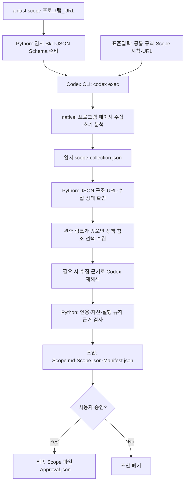

# 02. Scope 승인이 Recon 작업이 되기까지

**질문:** 프로그램 URL을 넣으면 누가 규칙을 수집·해석하고, 어떤 파일을 승인하며, 그 결과가 어떻게 Recon 작업이 되는가?

## 먼저 구분할 것

입력하는 **프로그램 URL**은 허용 자산과 규칙이 적힌 버그바운티 프로그램 페이지다. 실제 검사할 **대상 URL·도메인**은 그 페이지에서 수집한 `in_scope_assets` 중에서 나중에 선택한다. 프로그램 페이지 수집 중에는 대상 방문이나 보안 테스트를 하지 않도록 지시한다. [URL 식별](../../src/aidast/scope/paths.py), [Scope 프롬프트](../../src/aidast/agents/main.py)

Scope 전체 순서는 Python이 관리한다. Codex는 정해진 호출에서 화면 선택이나 규칙 해석을 맡는다. `CodexMainAgent`라는 클래스 이름이 있다고 해서 Scope 수집이 별도 하위 Agent를 자유롭게 생성하는 구조는 아니다. Agent라는 용어의 구분은 [07. Agent의 경계](07-agent-boundaries.md)를 본다. [ScopeCoordinator](../../src/aidast/orchestration/scope.py), [CodexMainAgent](../../src/aidast/agents/main.py)

## CLI 입력과 두 수집 경로

사용자가 입력하는 `aidast` 명령과 Python이 내부에서 실행하는 `codex exec`는 다르다. Scope만 수집할 때는 다음처럼 입력한다. `--identity`는 계정을 구분할 브라우저 프로필 이름이며 로그인 정보 자체가 아니다. [CLI 파서·수집 연결](../../src/aidast/cli.py), [프로필 분리](../../src/aidast/scope/reader.py)

```powershell
aidast scope "<프로그램 URL>"
aidast scope "<프로그램 URL>" --login-mode runtime-browser --identity primary
```

| 경로 | 페이지를 읽는 주체 | Codex가 하는 일 | 접근 확인 |
| --- | --- | --- | --- |
| CLI 기본 `native` | Codex 브라우저 | 페이지 수집과 초기 분석을 함께 반환 | 인증 실패를 자동으로 사용자 브라우저 경로로 전환하지 않음 |
| CLI `runtime-browser` | Python `RuntimeBrowserProgramPageReader`의 Playwright 브라우저 | 관측된 화면의 이동 후보 선택, 수집한 원문 해석 | 필요한 경우 사용자 로그인·접근 확인 후 계속 |
| WebUI 화면의 기본 수집 | 위와 같은 Python Reader | 위와 같은 화면 선택·원문 해석 | `awaiting_browser`에서 화면의 계속 버튼으로 재개 |

CLI는 `JAVASCRIPT_RENDER_INCOMPLETE`인 native 수집에 한해 제공된 `PlaywrightProgramPageReader`로 재수집할 수 있다. 인증 필요·접근 거절이면 이 대체 수집으로 해결하지 않는다. WebUI의 기본 `runtime-browser` 경로에는 대체 Reader를 연결하지 않는다. API 모델의 기본값 `headless`와 실제 화면이 보내는 기본값 `runtime-browser`도 서로 다르다. [CLI 연결](../../src/aidast/cli.py), [대체 수집 조건](../../src/aidast/orchestration/scope.py), [WebUI 요청](../../WebUI/src/lib/scope.ts), [WebUI 작업자](../../src/aidast/web/scope_workflow.py), [관련 테스트](../../tests/test_scope_workflow.py)

다음 그림은 **CLI 기본 native** 흐름이다. runtime-browser에서는 처음의 브라우저 수집을 Python Reader가 맡고, 분석을 별도 Codex 호출로 수행한다. [수집 분기](../../src/aidast/orchestration/scope.py)



### Python이 Codex에 전달하는 것

`_run_structured()`는 임시 작업 폴더에 공통 정책 Skill, Scope Skill과 출력 JSON Schema를 준비한다. `--output-schema`로 반환 구조를 지정하고 `--output-last-message`로 응답 파일을 받는다. 마지막 인자 `-`를 사용하며 공통 정책과 작업 프롬프트는 표준입력으로 전달한다. 호출에는 `--ephemeral`, `--ignore-user-config`, `--sandbox read-only` 등이 적용되고 shell·apps·별도 웹 검색은 비활성화된다. [실제 호출](../../src/aidast/agents/main.py)

`collect_scope()`는 프로그램 URL, 화면별 원문과 관측 링크, 초기 `ScopeAnalysis`를 담은 `ScopeCollectionResult`를 받는다. Python은 Pydantic 구조, 응답 크기, 최종 URL의 HTTPS·호스트 조건 등을 검사한다. `interpret_captured_scope()`는 이미 수집된 `ProgramPage`를 받아 브라우저 없이 `ScopeAnalysis`를 반환한다. 따라서 **한 번의 모델 응답이 곧 최종 승인 Scope는 아니다.** [모델 호출·근거 검사](../../src/aidast/agents/main.py), [결과 모델](../../src/aidast/scope/models.py)

## 추가 정책 참조와 재해석

프로그램 화면에 외부 정책 링크가 관측되면 다음 절차를 거친다. 임의의 정책 URL을 모델이 만들어 방문하는 방식은 아니다. [참조 준비](../../src/aidast/scope/policy_references.py)

1. Codex가 **관측된 링크의 ID**와 부모 화면의 정확한 인용을 반환하고, 그 참조가 testing·reporting·disclosure 등에 적용되는지, 필수 참조인지 보조 자료인지 제안한다.
2. Python이 링크 ID와 인용을 검사한 뒤 `PublicPolicyDocumentReader`로 문서를 읽는다. 이 Reader는 프로그램 브라우저의 인증·쿠키를 재사용하지 않으며, 공개 HTTPS의 텍스트·HTML만 지원한다. 기본 한도는 최대 8문서·2단계 참조 깊이다.
3. 참조가 있거나 초기 실행 규칙 해석이 불완전하면, 프로그램 원문과 출처가 붙은 참조 원문을 넣어 Codex를 다시 호출한다.
4. Python은 원문에 없는 인용·허용 자산을 거부하고, 검증된 해석을 초안에 저장한다. 실제 대상 요청이나 Recon 실행은 아직 하지 않는다.

근거는 [수집 조정](../../src/aidast/orchestration/scope.py), [참조 선택·한도](../../src/aidast/scope/policy_references.py), [공개 문서 Reader](../../src/aidast/scope/policy_transport.py), [참조 수집 테스트](../../tests/test_scope_policy_preparation.py)에 있다.

**허용 자산과 허용 활동의 근거는 원래 프로그램 페이지다.** 외부 참조는 제약이나 제출·공개 의무를 보강할 수 있지만 새 자산·활동 권한을 추가하는 근거로 쓰지 않는다. 재해석 후에도 초기 분석의 `allowed_activities`와 `safe_harbor`를 유지하고, 각 허용 자산과 근거 인용이 프로그램 원문에 있는지 검사한다. 이것은 코드의 근거·구조 검사이며 자연어 해석 전체가 정확하다는 보증은 아니다. [권한 보존·자산 근거 검사](../../src/aidast/orchestration/scope.py), [외부 권한 확대 거부 테스트](../../tests/test_scope_policy_preparation.py)

### 어떤 규칙이 실행을 막는가?

| 구조화된 내용 | 실행 시 의미 |
| --- | --- |
| `request_limits`·`option_limits`·`allowed_methods` | 요청량·실행 옵션·메서드 등의 제약을 정책에 결합 |
| `required_request_headers`·`required_inputs` | 필요한 식별 헤더·운영자 입력값을 준비하고 검사 |
| `required_confirmations` | 해당 의무를 운영자가 이행했다고 명시적으로 확인해야 함 |
| `blocking_requirements` | 지원하는 실행 제어로 만족시킬 수 없는 명시적 필수 조건이면 적용 대상의 실행을 거부 |
| `advisories` | 적용 범위·문맥 등의 불확실성을 기록한 지침. 이 기록 자체가 실행 거부 조건은 아님 |
| `submission_requirements` | 보고서 제출·공개 단계의 의무. 이것만으로 테스트 시작을 막지는 않음 |

참조 문서 수집 실패도 원인과 출처를 `unresolved`로 남긴다. testing·mixed·unknown 참조의 미수집은 현재 코드에서 **자동 blocker가 아니라 advisory**로 보강한다. “모호한 내용이나 못 읽은 링크가 있으면 무조건 중단한다”는 설명은 현재 구현과 다르다. 명시적 필수 제한과 대상별 적용 조건은 별도로 유지한다. [규칙 추출 지침](../../src/aidast/agents/main.py), [미수집 참조 처리](../../src/aidast/scope/policy_references.py), [실행 전 필수 조건 검사](../../src/aidast/scope/execution_rules.py), [blocker와 advisory 테스트](../../tests/test_policy_advisory_launch.py)

## 초안과 승인 산출물

| 결과 | 생성 주체·저장 위치 | 의미 |
| --- | --- | --- |
| `scope-collection.json` | Codex CLI, 임시 모델 작업 폴더 | native 수집·초기 분석 응답. Python이 읽은 후 임시 폴더 정리 |
| `Scope.md` | Python, 초안 폴더 → 승인 폴더 | 사람이 검토할 규칙·자산·근거 문서 |
| `Scope.json` | Python, 같은 폴더 | `source`의 수집 원문·참조 기록과 `analysis`의 구조화된 Scope |
| `Manifest.json` | Python, 같은 폴더 | Scope ID와 JSON·Markdown SHA-256 |
| `Approval.json` | Python, 승인 시 추가 | 승인자·시각·Scope ID·승인한 파일 해시 |

최종 산출물은 **Markdown 하나와 JSON 세 개**다. 수집 원문만 따로 저장하는 세 번째 JSON이 있는 것이 아니라 `Scope.json` 안에 원문과 해석이 함께 있다. CLI 기본 저장 위치는 `result/Scope/<platform>/<program>/`이며 `--output-dir`은 그 Scope 루트를 변경한다. 초안은 기본적으로 최종 폴더의 부모 아래 임시 폴더에 만든다. 기존 최종 폴더를 자동 덮어쓰지 않는다. [파일 생성·게시](../../src/aidast/orchestration/scope.py), [CLI 경로](../../src/aidast/cli.py), [프로그램 경로 식별](../../src/aidast/scope/paths.py)

CLI의 검토 질문에서 승인하면 `approve_draft()`가 다시 근거·해시를 검사하고 네 파일을 게시한다. 거절하거나 입력 없이 종료되면 초안을 폐기한다. 재사용 시 `load_approved_scope()`가 네 파일의 구조, ID와 해시를 대조한다. 따라서 **AI 해석 완료**, **초안 생성**, **운영자 승인**은 서로 다른 상태다. [수집·승인·재사용](../../src/aidast/orchestration/scope.py), [검토 입력](../../src/aidast/cli.py), [승인·변경 감지 테스트](../../tests/test_scope_workflow.py)

직접 `aidast scope`를 실행하면 WebUI의 `programs.db`·`scope_jobs.db`에 등록하지 않는다. 실제 CLI 진입점에서 모델 호출 메타데이터는 `SQLiteModelCallSink(RESULT_ROOT)`의 `logs/CodexCalls.db`에 기록하며, 이 경로는 Scope의 `--output-dir`과 별도로 결정한다. WebUI의 DB와 승인 revision은 [08. 대시보드](08-dashboard.md)를 본다. [CLI 진입점](../../src/aidast/cli.py), [모델 호출 기록](../../src/aidast/core/model_calls.py)

## 승인 Scope가 Recon 작업이 되는 과정

`승인 스냅샷 → 실행 규칙 준비 → 대상 선택 → Recon Plan → Task → TargetPolicy → Recon 실행`

1. `aidast run`은 `--target` 또는 `--all-targets`로 대상 선택을 요구한다. 기존 Scope가 있으면 승인 스냅샷을 검사해 재사용하고, 없으면 수집·검토·승인부터 시작한다. 지정한 revision은 그 revision만 검증하며 다른 Scope로 바꾸지 않는다. [CLI의 run 파서와 _run_recon](../../src/aidast/cli.py), [revision 테스트](../../tests/test_scope_policy_refresh.py)
2. 실행 규칙이 누락된 구버전 Scope 등은 `ScopeExecutionResolver`가 **승인 당시 수집 원문**을 오프라인으로 재해석한다. 보강 결과는 결과 루트의 `.execution-requirements/<digest>.json`에 별도 저장한다. 승인한 `Scope.md`·`Scope.json`을 바꾸거나 현재 웹페이지를 다시 읽는 과정은 아니다. [실행 규칙 해석·캐시](../../src/aidast/scope/execution_rules.py), [승인 파일 불변 테스트](../../tests/test_policy_advisory_launch.py)
3. `_select_recon_targets()`가 승인된 자산 중 요청한 대상을 고른다. 웹 실행 경로가 지원하는 자산은 URL·API·DOMAIN·WILDCARD·IP_ADDRESS다. 승인 목록에 있다고 해서 모바일 앱·소스코드·CIDR 등도 이 실행기로 처리할 수 있는 것은 아니다. [대상 선택](../../src/aidast/cli.py), [실행 가능 자산](../../src/aidast/agents/main.py)
4. AI가 선택된 정식 자산 ID로 Recon Plan을 제안한다. Python은 ID를 승인 자산에 대응시키고 실행에 필요한 선행 단계를 보완한다. `ReconCoordinator.create_tasks()`는 Plan이 승인 Scope에 속하는지 검사하고 단계별 Task와 의존관계를 만든다. Plan·Task 목록은 이 CLI 경로의 메모리 객체이며, 실행 이력은 `Recon.db`의 `pipeline_runs`에 기록한다. **이 Plan은 정찰 계획이며, Handoff 이후 Attack에서 만드는 취약점 가설과 다르다.** [Plan 생성](../../src/aidast/agents/main.py), [단계 보완·전달](../../src/aidast/cli.py), [Task 생성](../../src/aidast/orchestration/recon.py), [Task 실행 이력](../../src/aidast/recon/executor.py), [Attack 가설 계획](04-attack-chaining.md)
5. 실행 경로에서는 AI가 대상별 정책을 제안하고 Python이 검증한다. 제외 자산, Scope 제약, 사용자·프로필 상한, 필수 헤더, 실행 규칙·공유 요청 예산·조건부 제외 준비를 결합해 `TargetPolicy.json`을 만든다. **Scope 승인만으로 모든 요청이 허용되는 것은 아니다.** 실제 요청은 실행기의 정책 검사를 다시 거친다. [CLI 정책 구성](../../src/aidast/cli.py), [TargetPolicy 모델·검증](../../src/aidast/recon/policy.py), [실행 규칙 결합](../../src/aidast/scope/execution_rules.py), [조건부 제외 준비](../../src/aidast/scope/exclusion_preparation.py)

## 검증의 의미와 한계

ID와 파일 해시 대조는 저장된 승인 파일이 변경됐는지 확인한다. 프로그램의 현재 웹 규칙이 바뀌었는지, 승인자가 실제 프로그램 운영자인지, 외부에서 새로운 권한을 부여했는지는 증명하지 않는다. 검토자는 원문과 초안을 대조해 해석을 승인해야 한다. [스냅샷 검증](../../src/aidast/orchestration/scope.py), [검토 안내](../../src/aidast/cli.py)

Python이 확인하는 `COMPLETE` 수집 상태와 정확한 인용도 모든 규칙이 빠짐없이 수집·해석됐다는 보장은 아니다. native는 모델의 수집 결과를 받고, Python Reader는 화면 텍스트와 수집 상태 분류를 사용한다. 화면 누락·잘못된 규칙 적용은 사람의 검토와 별도 사례 검증이 필요한 부분이다. [native 검사](../../src/aidast/agents/main.py), [Reader 수집·분류](../../src/aidast/scope/reader.py), [초안 검사](../../src/aidast/orchestration/scope.py)

## 다음 연결

`TargetPolicy`와 의존관계가 있는 Task가 [03. Recon과 Handoff](03-recon-handoff.md)로 넘어간다. 정책 강제 모드에서 정책 없는 Task는 거부된다. 세부 옵션과 운영 절차는 [OPERATIONS](../OPERATIONS.md)를 원본으로 본다. [ReconExecutor._policy_for](../../src/aidast/recon/executor.py)

## 확인할 질문

1. 프로그램 URL과 실제 검사 대상은 언제 구분되는가?
2. `Scope.json` 안에서 수집 원문과 해석 결과는 어디에 있는가?
3. 승인 파일의 해시 검사와 현재 프로그램 정책 재수집은 어떻게 다른가?
4. `advisories`와 `blocking_requirements`는 실행에 어떤 차이를 만드는가?
5. Recon Plan과 Attack 가설 계획은 각각 어느 단계에서 만드는가?
