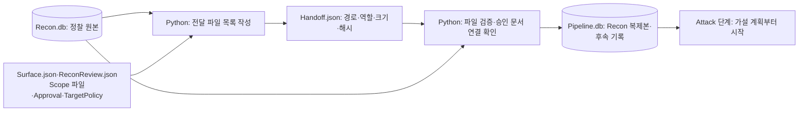

# 03. Recon 결과를 검증하고 전달하는 Handoff

**질문:** Recon은 무엇을 남기고, Handoff 이후 어느 단계에서 Attack 가설을 제안하는가?

현재 통합 `aidast run`의 주 흐름은 **Recon 관측·태깅·검토 → Python의 결과 검증·전달(Handoff) → `Pipeline.db` 생성 → Attack 가설 계획**이다. Handoff는 별도 AI Agent가 아니라 Python의 파일 검증·복제 절차다. [CLI 연결 순서](../../src/aidast/cli.py), [DB 생성](../../src/aidast/pipeline/materialize.py), [Attack 시작](../../src/aidast/orchestration/attack.py)

## Recon에서 만드는 자료

`ReconCoordinator`가 만든 Task는 `ReconExecutor.run()`에서 의존관계 순서대로 실행된다. 한 타깃의 Task가 실패하면 그에 의존한 Task는 건너뛰지만 독립 타깃은 계속 처리하고 실패 건수를 반환한다. HTTP 단계는 자산별 `TargetPolicy`와 요청 브로커를 사용한다. [Task 생성](../../src/aidast/orchestration/recon.py), [Executor](../../src/aidast/recon/executor.py), [RequestBroker](../../src/aidast/core/request_broker.py)

| 처리 | 주체와 의미 | 결과 저장 위치 |
| --- | --- | --- |
| 관측 수집 | Python 실행기·도구가 자산, endpoint, 입력값, 응답 등의 관측을 저장 | `Recon.db` |
| 관측 태깅 | AI가 저장된 관측을 분류하고 Python이 응답을 검사·저장 | `Recon.db`의 annotation 관련 테이블 |
| 오프라인 검토 | AI가 승인 자산별 집계와 정책을 보고 추가 정찰을 추천. Python이 범위·중복·예산을 검사 | `ReconReview.json` |
| Surface 내보내기 | Python이 DB의 정찰 표면을 JSON으로 내보냄 | `Surface.json` |

통합 CLI는 태깅을 켜고, 관측 태깅·`OfflineReconReview.review()`·Surface 내보내기를 연결한다. `ReconReview`의 입력은 자산별 endpoint·관측 등의 **집계 수와 정책**이며, 수집 원문 전체를 전달하는 검토가 아니다. 통합 경로에서는 `review()`를 한 번 호출하고 추천·수락 여부·종료 사유를 파일로 남긴다. [통합 CLI](../../src/aidast/cli.py), [관측 태깅](../../src/aidast/recon/annotations.py), [집계와 검토 모델](../../src/aidast/recon/agent.py), [AI 검토 호출](../../src/aidast/agents/main.py)

Recon 검토에서 `accepted=true`는 **검토 대상으로 적합한 추천**이라는 뜻이다. 그 추천을 새 `ReconTask`로 만들어 자동 실행하는 뜻은 아니다. 또한 이 추가 정찰 추천과 후속 Attack의 취약점 가설은 서로 다른 결과다. [추천의 의미와 실행 경계](../../src/aidast/recon/agent.py), [오프라인 검토 테스트](../../tests/test_recon_agent.py)

Recon 실패 Task가 남으면 scan은 `completed_with_errors`가 되고 통합 Handoff·Attack은 진행하지 않는다. 태깅 실패는 완료 검사에서 예외로 중단한다. 반면 오프라인 검토의 `planner_error`·`invalid_proposal`은 종료 사유로 기록되며, CLI가 그 값만으로 Handoff를 막지는 않는다. **검토 파일의 존재를 수집 완전성이나 AI 검토 성공의 보장으로 읽지 않는다.** [실패 처리와 연결 조건](../../src/aidast/cli.py), [검토 오류 처리](../../src/aidast/recon/agent.py)

## Handoff는 파일 목록 작성과 검증·복제 절차

`_write_recon_handoff()`는 승인 Scope의 `Scope.md`·`Scope.json`·`Approval.json`과 `TargetPolicy.json`을 실행 폴더에 복사한다. 이 네 파일과 `Recon.db`·`Surface.json`·`ReconReview.json`의 상대 경로, 역할, 크기, SHA-256을 `Handoff.json`에 기록한다. `Handoff.json`은 DB가 아닌 **전달 파일 목록(manifest)**이다. [Handoff 작성](../../src/aidast/cli.py), [manifest 모델](../../src/aidast/pipeline/models.py)

`materialize_pipeline()`은 다음을 수행한다.

1. manifest의 형식과 각 파일의 경로·존재·크기·해시를 검사한다.
2. 정상 CLI Handoff에 포함된 `Scope.md`와 `Approval.json`을 함께 읽고, 승인 기록의 Markdown 해시가 전달된 문서와 맞는지 확인한다. 승인 Scope의 텍스트 스냅샷과 연결 정보를 후속 DB에 보관한다.
3. `Recon.db`를 읽기 전용 SQLite 연결로 열고 backup API로 새 DB에 복제한다. 후속 단계의 테이블과 원본 추적 정보를 추가한다.
4. 복제 전후의 원본 DB 해시가 같은지 확인한 뒤 `Pipeline.db`를 게시한다. 대상 DB가 이미 있으면 덮어쓰지 않고 실패한다.

[DB 생성 구현](../../src/aidast/pipeline/materialize.py), [파일 검증](../../src/aidast/pipeline/models.py), [Scope·승인 연결 검사](../../src/aidast/validation/contracts/eligibility.py), [변경·승인 불일치·원본 보존 테스트](../../tests/test_pipeline_materialization.py)

**계약의 범위:** 정상 CLI는 Scope·승인 파일을 모두 전달한다. 일반 `materialize_pipeline()` 함수는 Scope Markdown과 승인 파일 중 하나만 있으면 거부하지만, 둘 다 없는 최소 manifest도 허용한다. 따라서 이 함수 하나가 모든 호출에서 사용자 승인을 강제한다고 설명하면 안 된다. [조건식](../../src/aidast/pipeline/materialize.py), [최소 manifest와 부분 전달 테스트](../../tests/test_pipeline_materialization.py)

| 파일             | 역할                | 다음 단계에서의 취급                      |
| -------------- | ----------------- | -------------------------------- |
| `Recon.db`     | 정찰의 원본 관측         | Handoff 검증 대상, 복제 원본             |
| `Handoff.json` | 어떤 원본 파일을 넘겼는지 기록 | 해시·역할 검증의 기준                     |
| `Pipeline.db`  | Recon 복제본과 후속 테이블 | Attack부터 Validation까지 기록하는 공용 DB |

`Pipeline.db`의 `pipeline_sources`는 원본 manifest와 DB의 경로·해시를 보관한다. 이 행은 UPDATE·DELETE 방지 트리거로 보호된다. 이는 전체 DB 파일에 대한 암호학적 서명과는 다르다. [Live schema](../../src/aidast/pipeline/live_schema.py)

## 가설은 Handoff 이후 Attack에서 계획한다

Native 실행용 가설 계획은 `Pipeline.db`가 만들어진 뒤 `AttackCoordinator.run()`이 호출하는 `plan_recon_attack()`에서 수행한다. 저장된 endpoint·입력값·태그·응답 단서를 보고 AI가 가설 또는 근거 부족 결정을 제안하면 Python이 검사·저장한다. 이 계획 호출 자체는 요청을 보내지 않는다. [호출 순서](../../src/aidast/cli.py), [Native 가설 계획](../../src/aidast/attack/recon_hypotheses.py), [Attack 자세히](04-attack-chaining.md)

**현재 CLI의 부수 경로:** 실제 코드는 Handoff 파일 작성 후, `Pipeline.db`를 만들기 **전**에 `_plan_attack()`으로 별도의 Legacy 오프라인 계획도 저장한다. 기본 위치는 `result/AttackRuns/<platform>/<program>/<scan_id>/legacy/Attack.db`이며, 관측 근거의 검토 Task를 보관한다. 이것은 Native의 endpoint별 가설·Coverage·실행 Task와 별개다. 발표의 주 흐름은 Native 중심으로 설명하고 이 Legacy 저장을 부수 경로로 표시하면 순서를 혼동하지 않는다. [CLI의 두 계획 경로](../../src/aidast/cli.py), [Legacy 검토 Task](../../src/aidast/attack/runtime.py), [Legacy DB 파일명](../../src/aidast/attack/store.py), [프로그램별 경로](../../src/aidast/scope/paths.py)

## 검증이 의미하는 것과 미확인 사항

manifest 해시는 **기록된 바이트가 달라졌는지** 검사한다. 최초 작성자 인증, Recon의 모든 경로 발견, 태그의 의미적 정확성, 취약점 성립을 입증하지 않는다. Handoff 이후 finding의 최종 판정은 [Validation](05-validation-report.md)에서 수행한다. [파일 검증의 계약](../../src/aidast/pipeline/models.py)

이 페이지는 현재 코드와 테스트 정의를 읽어 정리한 설명이다. 여기서 실제 대상 정찰·Attack을 실행하거나 일반 탐지 성능을 측정하지 않았다. 실행 폴더와 보존 규칙은 [운영 상세](../OPERATIONS.md#통합-파이프라인과-데이터-무결성)를 참고한다.

## 확인할 질문

1. Recon의 추가 정찰 추천과 Attack의 취약점 가설은 입력·출력이 어떻게 다른가?
2. Handoff의 해시 검사와 Validation의 취약점 판정은 각각 무엇을 확인하는가?
3. Legacy의 `Attack.db`와 Native의 `Pipeline.db`를 구분해야 하는 이유는 무엇인가?
