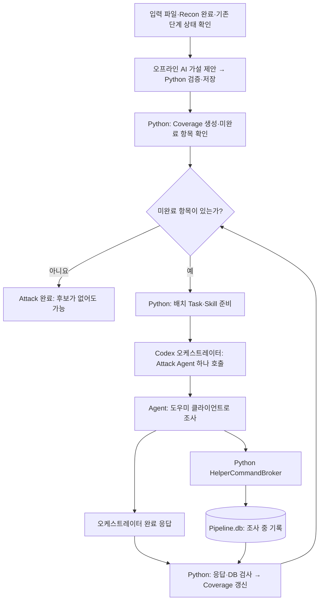

# 04. Attack 후보와 Chaining의 경계

**질문:** 정찰 결과가 취약점 후보와 연결 후보가 되는 과정에서 무엇이 검증되는가?

현재 통합 Native 경로에서 **취약점 가설 계획은 Handoff로 `Pipeline.db`를 만든 뒤 Attack 단계에서 시작한다.** 가설 계획 AI는 저장된 자료를 분석하는 구조화된 호출이고, 실제 조사 역할의 Attack Agent는 Python이 실행 Task를 준비한 다음 배치마다 호출한다. 두 AI 역할과 Python의 제어 절차를 구분해 읽는다. [CLI 연결](../../src/aidast/cli.py), [AttackCoordinator](../../src/aidast/orchestration/attack.py), [Handoff](03-recon-handoff.md)

## Attack의 입력과 작업

`AttackCoordinator.run()`은 `Pipeline.db`·실행 폴더의 `Scope.md`·`TargetPolicy.json`의 존재와 Recon scan의 완료 상태를 확인한다. 그 뒤 저장된 endpoint에서 가설을 계획하고 Coverage 목록을 만든다. 실행할 항목이 없으면 후보 없이 단계를 완료할 수 있다. 항목이 있으면 `ExhaustiveAttackCoordinator`가 제한된 배치로 작업을 수행한다. **이 시작 함수 자체가 Scope 승인 해시를 다시 검사하는 것은 아니다.** 앞선 Scope·Handoff의 검증과 구분한다. [AttackCoordinator](../../src/aidast/orchestration/attack.py), [가설 계획](../../src/aidast/attack/recon_hypotheses.py), [배치 실행](../../src/aidast/orchestration/coverage_attack.py)

| 입력 | 용도 |
| --- | --- |
| `Pipeline.db`의 Recon 복제본 | 관측된 endpoint·입력값·태그·응답 단서 조회 |
| 실행 폴더의 `Scope.md`, `TargetPolicy.json` | 조사 범위와 실행 조건 전달 |
| Python이 만든 배치 Task | 이번 호출에서 처리할 가설·입력·Skill 지정 |
| 기존 attempt·fact·finding, 인증 참조·테스트 객체 사실 | 이전 조사 및 사용 가능한 사용자·객체 문맥 제공 |

인증 참조와 객체 사실은 DB에 제공된 경우 전달하는 정보다. URL을 입력했다는 이유만으로 다중 사용자나 소유 객체가 모두 준비된다고 가정하지 않는다. [Task 구성](../../src/aidast/attack/coverage.py), [Agent 입력 구성](../../src/aidast/agents/native_pipeline.py)

배치 결과는 Agent의 응답만 믿고 완료하지 않는다. Coordinator가 DB에 기록된 finding·attempt와 응답을 대조하고, coverage 상태 및 Task의 종료 여부를 검사한다. [Attack 결과 검증](../../src/aidast/orchestration/attack.py), [coverage 배치](../../src/aidast/orchestration/coverage_attack.py)

`finding`은 **검증할 주장**이다. Attack의 matcher나 attempt가 긍정 신호를 남겨도 최종 판정은 [Validation](05-validation-report.md)의 case에서 이뤄진다. [README의 후보 설명](../../README.md#주요-기능), [Validation 대상 선택](../../src/aidast/validation/orchestration/coordinator.py)

## 비슷해 보이는 결과 이름 구분

| 이름 | 의미 | 저장 위치 |
| --- | --- | --- |
| 가설 | 관측 근거로 제안한 조사 가능성. 취약점 성립 주장이 아님 | `Pipeline.db`의 `endpoint_annotations` 중 `attack_hypothesis` |
| Endpoint 검토·계획 진단 | 가설을 만들었는지, 근거가 부족한지, 제안의 어떤 부분이 거부됐는지 | `Pipeline.db`의 `attack_endpoint_reviews`, `attack_planning_diagnostics` |
| Coverage 항목 | 특정 endpoint·가설·입력·사용자 조건을 처리했는지 추적하는 목록 | `Pipeline.db`의 `attack_coverage_items` |
| Task | 현재 배치에 배정한 실행 작업 | `Pipeline.db`의 `attack_tasks` |
| attempt / lead | 조사 시도와 결과 / 후속 해석이 필요한 열린 관측 | `Pipeline.db`의 `attack_attempts` |
| fact | 후속 작업에서 참고할 사실 주장. 존재만으로 독립 검증된 증명이 아님 | `Pipeline.db`의 `attack_facts` |
| finding·재현 명세 | 증거가 연결된 취약점 후보와 다시 확인할 계약 | `Pipeline.db`의 `findings`, `finding_reproduction_specs` |

[가설·검토 저장](../../src/aidast/attack/recon_hypotheses.py), [Coverage·Task](../../src/aidast/attack/coverage.py), [조사 기록과 원자적 finding 저장](../../src/aidast/attack/db_cli.py)

## Native Attack의 정확한 실행 흐름

이 그림은 통합 `AttackCoordinator.run()`의 정상 배치 흐름을 단순화했다. 시작 함수는 입력 파일 존재, Recon 완료와 중복 실행 상태를 검사하며, 그 함수 자체가 Scope 승인 해시를 재검증하는 것은 아니다. 승인·원본 검증은 앞선 Scope/Handoff 단계와 구분한다. [시작 조건](../../src/aidast/orchestration/attack.py), [Handoff](03-recon-handoff.md)

가설 계획은 관측된 endpoint·입력값·태그·응답 단서와 사용 가능한 Skill 목록을 입력으로 하는 구조화된 AI 호출이다. 이 계획 호출에서는 브라우저·요청 실행을 하지 않는다. Python은 endpoint·annotation·입력 이름과 위치가 제공 자료에 맞는지, 취약점 유형·사용자 조건이 허용된 값인지 검사하고 가설·검토·진단을 저장한다. 이 검사는 실제 인증 계정의 확보나 취약점 성립을 증명하지 않는다. 관측이 변하지 않았다면 기존 검토를 재사용하며, 기존 source/benchmark annotation이 있으면 해당 endpoint의 AI 계획을 건너뛸 수 있다. [계획·재사용](../../src/aidast/attack/recon_hypotheses.py), [제안 검사](../../src/aidast/attack/hypothesis_validation.py)

계획 호출은 한 번에 최대 16개 endpoint를 분석하고, 제안 검사 실패에 대해 제한된 수정 호출을 수행한다. 이후 실제 조사 배치의 최대 8개 Task와는 다른 크기다. 또한 계획에 포함된 관측·태그·입력값은 제한된 요약 창이므로, 전체 원문을 빠짐없이 읽었다고 설명하지 않는다. [계획 입력 상한과 수정 루프](../../src/aidast/attack/recon_hypotheses.py)

정상 통합 경로는 배치당 최대 8개 Task를 사용한다. 오케스트레이터는 배치마다 custom `aidast_attack` Agent 하나를 생성하도록 지시받고, Python은 완료 응답에 Agent ID가 하나인지 검사한다. 이 ID 검사만으로 실제 spawn 이벤트 전체를 검증한다고 해석하지 않는다. [배치 크기](../../src/aidast/orchestration/attack.py), [오케스트레이터 준비](../../src/aidast/agents/native_pipeline.py), [8개·2개 배치 테스트](../../tests/test_recon_attack_hypotheses.py)

`attack_request`, `attack_template`, `attack_db`는 임시 Python 클라이언트와 브로커를 통해 허용된 패키지 명령을 실행하는 도우미다. Agent가 DB에 직접 접속하는 구조로 단순화하지 않는다. `attack_template`는 관측·matcher 결과를 반환하고 finding을 직접 생성하지 않는다. finding은 DB 도우미를 통해 증거·재현 명세와 함께 조사 중 저장되며, 완료 검사 뒤 새로 만들어지는 것이 아니다. [브로커](../../src/aidast/agents/helper_broker.py), [템플릿 도우미](../../src/aidast/attack/template_cli.py), [finding 저장](../../src/aidast/attack/db_cli.py)

완료 검사는 오케스트레이터의 DB 재조회 지침과 Python의 실제 응답·DB 검사로 나뉜다. Python은 응답의 scan·stage·DB·Agent ID, 보고된 finding과 새 저장 기록, 재현 명세, 이번 호출 이후의 미해결 lead, 배치 Task 종료, 결과 불명 HTTP 등을 확인하고 Coverage를 갱신한다. 남은 항목은 다음 배치에서 처리한다. **이 완료 검사가 finding 설명의 모든 의미나 실제 영향의 정확성을 검증하는 것은 아니다.** [오케스트레이터 계약](../../src/aidast/skills/attack/orchestrator/SKILL.md), [Python 검사](../../src/aidast/orchestration/attack.py), [배치 반복](../../src/aidast/orchestration/coverage_attack.py)

**Attack 완료는 모든 항목이 성공적으로 테스트됐다는 뜻이 아니다.** Coverage의 종료 상태에는 후보·미관측뿐 아니라 인증 부족, 정책 제외, 지원 불가, 최종 오류도 포함된다. 최종 종료는 미완료 Coverage가 0인지 확인하며, 계획 진단의 unresolved 항목은 별도 근거 부족 기록으로 남을 수 있다. [Coverage 상태](../../src/aidast/attack/coverage.py), [계획 진단](../../src/aidast/attack/recon_hypotheses.py), [오류·지원 불가 종료 테스트](../../tests/test_attack_coverage.py)

| 저장소 | 역할 |
| --- | --- |
| `Pipeline.db` | Recon 복제본, 가설·검토·진단, Coverage·Task·단계 상태, 요청·attempt·fact·finding·재현 명세 |
| WebUI DB: `<RESULT_ROOT>/.webui/events.db` | WebUI 연동 시 진행 이벤트. 조사 근거 DB와 구분 |
| 호출 기록 DB: `<RESULT_ROOT>/logs/CodexCalls.db` | 모델 호출 상태·사용량 등 메타데이터 |

`<RESULT_ROOT>`는 [시작점에서 설명한 결과 루트](01-pipeline-entrypoints.md)이며, 소스 체크아웃의 기본값은 저장소의 `result/`다. [Pipeline 기록](../../src/aidast/attack/coverage.py), [WebUI 이벤트](../../src/aidast/web/projection.py), [호출 기록](../../src/aidast/core/model_calls.py)

현재 체크아웃의 Native 도우미 브로커는 POSIX 호스트만 허용한다. Windows Python에서는 브로커 시작 단계에서 거부되므로 이 그림을 현재 Windows 환경의 실행 성공 확인으로 읽지 않는다. Linux/WSL 사용 여부와 실제 실행 성공은 이 학습 점검에서 확인하지 않았다. [제한](../../src/aidast/agents/helper_broker.py), [브로커 시작 호출](../../src/aidast/agents/native_pipeline.py), [Windows 거부 테스트](../../tests/test_native_helper_broker.py)

## IDOR 지원과 성능을 구분해서 읽기

**구현으로 확인한 범위:** IDOR 가설을 `hunt-idor` Task로 연결하고, 인증 참조와 `owned_test_object` 등의 객체 사실을 전달하는 구조가 있다. live 지침은 IDOR 비교에 서로 다른 참조 두 개를 요구하고, 인증 부족으로 종료한 Coverage를 다시 열 때도 사용 가능한 참조 두 개를 확인한다. 다만 참조 두 개의 존재 자체가 서로 다른 실제 사용자·정확한 객체 소유권을 증명하지는 않는다. [Skill 연결·인증·객체 문맥](../../src/aidast/attack/coverage.py), [Attack 지침](../../src/aidast/skills/attack/live/SKILL.md)

**기존 실험이 확인한 범위:** 2026-09-26 로컬 VulnBank 실험은 두 테스트 사용자와 소유 객체를 미리 준비하고, 세 후보를 합성 Attack 주장으로 넣어 Validation을 시험했다. 정상 접근통제 두 사례는 `DISPROVEN`, 다른 사용자 목록이 반환된 한 사례는 `CONFIRMED`로 기대 결과와 일치했다. 이는 **준비된 후보의 Validation 판별 사례**이며, URL부터 시작해 Recon·Attack이 스스로 IDOR을 발견한 성능 측정은 아니다. [실험의 입력·결과·한계](../test-results/09.26/_archive/validation/AUTH_PREREQUISITE_ACCURACY.md)

IDOR의 의미를 판별하려면 호출 사용자, 객체 소유자, 원래 허용된 접근 관계를 알아야 한다. 응답 코드나 응답 유사성만으로는 충분하지 않다. 현재 프로필별 증거 감사는 `audit` 모드이며 의미적 소유권 증명 부족이 자동으로 모든 확정을 차단하는 강제 조건은 아니다. 따라서 지원 코드와 제한된 실험을 일반 탐지율·오탐률 보장으로 확대하지 않는다. [IDOR Validation 계약](../../src/aidast/skills/validation/library/hunt-idor/contract.json), [증거 감사](../../src/aidast/validation/core/profile_evidence.py), [관측 신호만으로 소유자·행위자 증명이 되지 않는 테스트](../../tests/test_validation_profile_evidence.py)

## Chaining의 입력과 완료 조건

`ChainingCoordinator.run()`은 완료된 Attack stage를 요구한다. 기본 입력으로는 상태가 `unreviewed` 또는 `confirmed`인 finding 중, `attack_attempts.outcome='confirmed'`가 있는 것을 조회한다. 생성된 chain은 `demonstrated`로 기록되고 현재 단계의 성공적인 실행과 연결돼야 완료로 인정된다. [ChainingCoordinator](../../src/aidast/orchestration/chaining.py)

대상 finding이 없으면 Chaining은 Agent 없이 `SKIPPED`로 끝난다. 대상이 있으면 연결 후보를 검토하며, 모든 후보가 거부·근거 부족으로 정리돼도 새 chain 없이 완료할 수 있다. chain을 저장하려면 현재 단계의 성공한 재현, 단계 간 값 전달의 기록, 최종 영향 assertion이 필요하다. finding 제목이 비슷하다는 이유만으로 chain이 성립하는 것은 아니다. [입력 없음과 완료 검사](../../src/aidast/orchestration/chaining.py), [재현·영향 저장 조건](../../src/aidast/chaining/db_cli.py), [값 전달·최종 영향 테스트](../../tests/test_native_chaining_orchestration.py)

## 같은 “confirmed”라도 계층이 다르다

| 위치 | 의미 |
| --- | --- |
| Attack attempt의 `confirmed` | 해당 시도의 관측 결과 |
| finding 상태의 `confirmed` | Attack 저장소의 finding 상태 |
| Validation case의 `CONFIRMED` | 재현·대조군·영향 검사를 통과한 최종 case 판정 |

이 셋을 동일한 “확정 취약점”으로 합쳐 읽으면 파이프라인을 오해하게 된다. Chaining 입력의 attempt 조건은 [Chaining 코드](../../src/aidast/orchestration/chaining.py), Validation의 finding 선택 조건과 판정은 [Validation coordinator](../../src/aidast/validation/orchestration/coordinator.py)와 [DecisionEngine](../../src/aidast/validation/core/decision.py)에 있다.

`aidast attack`의 별도 승인형·Legacy 경로와 통합 CLI가 부수적으로 저장하는 `legacy/Attack.db`는 위 Native 가설·배치 흐름과 분리해 읽는다. 명령별 운영 방식은 [운영 상세](../OPERATIONS.md#legacy-attack-경로), 저장 순서·DB 이름은 [Handoff 페이지](03-recon-handoff.md)를 참고한다.

## 확인할 질문

1. Attack 가설이 0개면 왜 Chaining과 Validation 호출이 여전히 이어질 수 있는가?
2. Chaining의 `demonstrated`와 Validation의 `CONFIRMED`는 무엇이 다른가?
3. 두 사용자로 준비된 IDOR 후보의 Validation 성공과 전체 파이프라인의 IDOR 발견 성능은 왜 다른가?
