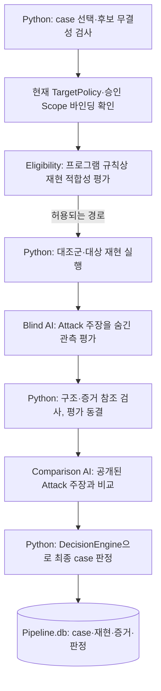

# 05. Validation 판정에서 Report 초안까지

**질문:** Attack 후보를 누가 다시 확인하며, 어떤 조건을 통과해야 보고서 초안이 되는가?

## 먼저 구분할 결과

Attack의 `finding`은 증거가 붙은 **후보**이고, Validation의 `case`는 그 후보나 chain을 다시 평가하는 단위다. Validation stage의 `completed`는 선택한 case의 처리를 끝냈다는 뜻이며 모든 case가 `CONFIRMED`라는 뜻이 아니다. 대상이 없으면 `case_ids=()`로 완료할 수도 있다. [case 선택·단계 결과](../../src/aidast/validation/orchestration/coordinator.py), [대상 없는 통합 테스트](../../tests/test_merged_pipeline_e2e.py)

이 페이지는 기본 공용 `Pipeline.db` 경로를 설명한다. CLI에 남아 있는 구형 개별 `Validation.db` 보고서 경로와 혼동하지 않는다. [CLI 경로 선택](../../src/aidast/cli.py), [Report 공개 API](../../src/aidast/reporting/__init__.py)

## Validation 입력과 선택 조건

기본 실행은 최신 Chaining stage가 `completed` 또는 `skipped`인지 확인한 뒤, 상태가 `unreviewed`·`confirmed`인 finding과 `demonstrated` chain을 case로 선택한다. finding 선택 SQL 자체에는 성공한 Attack attempt 조건이 없고, 선택 후 `CandidateIntegrityGate`가 후보·증거·재현 명세 등의 관계를 검사한다. Chaining의 기본 finding 선택 조건과 같은 필터라고 설명하면 안 된다. [Validation의 선택·후보 검사](../../src/aidast/validation/orchestration/coordinator.py), [후보 무결성](../../src/aidast/validation/core/integrity.py), [Chaining 입력](../../src/aidast/orchestration/chaining.py)

명시적으로 finding 하나를 지정하는 경로는 완료된 Attack stage를 요구하며 Chaining 완료 조건을 사용하지 않는다. 기존 case가 처리 완료라면 같은 case를 재검증하고, 아직 진행 중이면 중복 선택을 거부한다. [선택·재검증 분기](../../src/aidast/validation/orchestration/coordinator.py)

finding은 같은 scan의 최신 완료된 `CONFIRMED` case와 취약점 유형·endpoint template·method·주입 위치·parameter·필요 신원 역할·Skill의 메타데이터가 일치하면 `KNOWN`으로 연결될 수 있다. 이는 payload 의미를 비교하거나 새 재현을 수행한 결과가 아니다. chain은 먼저 각 node finding의 Validation 상태를 검사한다. node가 반증·범위 밖·보류 상태라면 chain도 해당 상태 또는 `INCONCLUSIVE`로 끝날 수 있으며, node가 통과한 경우에도 chain 자체의 후보 검사와 재현·평가를 수행한다. node 판정만으로 chain이 자동 확정되는 것은 아니다. [known 매칭·chain node gate](../../src/aidast/validation/orchestration/coordinator.py), [메타데이터 매칭 기준](../../src/aidast/validation/core/matching.py)

## Validation의 실제 흐름

위 그림은 기본 순서만 간추렸다. 조건부 적합성 재평가, 재현 계획 보완, 전제 조건 보완·영향 평가, 중단·재개 분기는 아래와 같다. 실제 재현을 수행하는 주체는 AI가 아니라 Python의 `RuntimeReproductionRouter`와 adapter다. [Coordinator 전체 흐름](../../src/aidast/validation/orchestration/coordinator.py), [Native 실행기 구성](../../src/aidast/validation/orchestration/native.py)

| 역할 | 입력과 결과 | 실행 경계 |
| --- | --- | --- |
| Eligibility | 승인 Scope와 후보의 재현 요약으로 `ELIGIBLE`·`INELIGIBLE`·`CONDITIONAL`·`UNKNOWN`을 평가 | 프로그램 정책상 적합성을 평가한다. 취약점 확정 상태를 반환하지 않는다. 명시적인 loopback 실습 정책은 정해진 조건에서 Python이 판별할 수도 있다. [Runner](../../src/aidast/validation/orchestration/eligibility_runner.py) |
| Replay preparation | 필요한 HTTP runtime contract가 없으면 저장된 자료로 보완안을 제안 | Python이 보완안의 구조와 범위를 확인한다. 정보가 부족하면 `INCONCLUSIVE`로 끝날 수 있다. [보완 코드](../../src/aidast/validation/orchestration/replay_preparation.py) |
| Reproduction | 재현 명세·정책·인증 참조를 받아 대조군과 대상을 실행 | Python adapter가 HTTP·브라우저·OOB·chain 등의 경로를 실행하고 요청·operation ledger와 증거를 남긴다. 선택 adapter는 의존성·명세 지원 여부에 따라 사용 가능하다. [구성](../../src/aidast/validation/orchestration/native.py), [Router](../../src/aidast/validation/execution/runtime_adapter.py) |
| Blind assessment | Attack의 주장 문안을 숨긴 case와 재현 관측으로 신호·막힘·영향을 평가 | 원래 주장을 보기 전에 구조화된 평가를 저장하고 해시로 동결한다. [Blind Runner](../../src/aidast/validation/orchestration/codex_runner.py), [동결 절차](../../src/aidast/validation/orchestration/coordinator.py) |
| Claim comparison | 동결된 Blind 평가와 공개된 Attack 주장을 비교 | 별도 Codex 세션에서 일치·충돌을 평가한다. 최종 Validation 상태는 반환하지 않는다. [비교 세션](../../src/aidast/validation/orchestration/codex_runner.py) |
| DecisionEngine | 정책, 대조군, 실제 재현 관측, AI 평가·비교의 구조화된 값 | Python 분기로 최종 상태를 고른다. AI의 의미 해석과 영향 점수는 여전히 입력에 포함된다. [판정](../../src/aidast/validation/core/decision.py), [입력 조립](../../src/aidast/validation/orchestration/coordinator.py) |

Eligibility가 `INELIGIBLE`이면 `OUT_OF_SCOPE`, `UNKNOWN`이면 `INCONCLUSIVE`로 종료하고 해당 재현을 진행하지 않는다. `CONDITIONAL`인 경우에는 재현 후 조건 충족 여부를 다시 평가할 수 있다. 전제 조건·영향 보완도 허용된 runtime contract와 정책 안에서만 수행한다. [적합성·보완 분기](../../src/aidast/validation/orchestration/coordinator.py)

## 대조군과 판정은 무엇을 확인하나?

기본 재현 batch는 positive control 1회, negative control 1회, target 3회로 구성된다. positive control은 신호를 관측할 수 있는 조건인지, negative control은 비활성 조건에서 같은 신호가 나오지 않는지 확인하는 비교 기준이다. target 결과가 일부만 양성이면 2회를 더 실행한다. 현재 `DecisionEngine`은 target 3회가 모두 양성인 경로에서 확정을 고려한다. 앞선 반증·정책·blocker 등의 분기에 해당하지 않는 5회 관측이나 혼합 관측은 `INCONCLUSIVE`로 처리한다. [재현 batch](../../src/aidast/validation/orchestration/coordinator.py), [판정 분기](../../src/aidast/validation/core/decision.py)

| 상태 | 현재 코드에서의 의미 |
| --- | --- |
| `CONFIRMED` | 정책·대조군·반복 관측·충돌·영향 조건을 통과한 case 판정 |
| `DISPROVEN` | 명시적인 반증과 모두 음성인 target 관측 등 반증 조건을 충족 |
| `OUT_OF_SCOPE` | 현재 정책이나 Eligibility에서 허용되지 않는 case |
| `INCONCLUSIVE` | 무결성 문제, 실패한 대조군, 관측 부족·혼합, 미지원 재현, 해소되지 않은 조건 등으로 결론을 내리기 어려움 |
| `UNDERPOWERED` | 신호는 재현돼도 현재 영향 점수가 충분하지 않음 |
| `CONTESTED` | Attack 근거와 Blind 평가·주장 비교 사이에 의미상 충돌이 있음 |
| `BLOCKED` | 보완 가능한 전제 조건이 해결되지 않아 확정하지 못함 |

이 표는 분기를 요약한 것으로 모든 상태가 `DecisionEngine` 하나에서만 시작되는 것은 아니다. 무결성·Eligibility·지원 여부 검사에서는 Coordinator가 먼저 종료할 수 있다. `KNOWN`과 보완 중의 `DEVELOPING` 등도 별도로 존재한다. 영향은 권한 경계·민감도·행위자 조건의 내부 점수이며 외부 CVSS 평가와 동일하지 않다. [Coordinator의 조기 종료](../../src/aidast/validation/orchestration/coordinator.py), [DecisionEngine·영향 점수](../../src/aidast/validation/core/decision.py)

재검증에서 이전 `UNDERPOWERED` case와 Scope·재현 관측이 같은 경우에는 AI의 재채점만으로 영향 점수가 올라가지 않도록 이전 점수로 상한을 둔다. 이는 의미 증거 audit와 별개의 보수적 재검증 규칙이다. [동일 재현의 영향 점수 제한](../../src/aidast/validation/orchestration/blind_consistency.py)

### IDOR에서 특히 주의할 증거 경계

IDOR에는 호출자·객체 소유자·객체의 관계, 보호된 객체 접근, 실제 호출자의 권한 정보가 필요하다는 프로필별 의미 증거 규칙이 있다. 그러나 현재 `evaluate_profile_evidence()`는 **`mode="audit"`**다. 부족한 의미 증거를 `blind_profile_evidence_audit`로 기록하지만, 그 기록 자체로 영향 점수를 낮추거나 `CONFIRMED`를 자동 차단하는 강제 판정 게이트는 아니다. [의미 증거 규칙](../../src/aidast/validation/core/profile_evidence.py), [audit 저장과 최종 입력](../../src/aidast/validation/orchestration/coordinator.py)

따라서 반복 신호가 양성이거나 assertion이 통과했다고 해서 사용자·소유권 관계까지 독립적으로 입증됐다고 말하면 안 된다. 테스트도 재현 신호와 assertion 기록만으로 `caller_owner_object_binding`을 증명하지 않는 경계를 확인한다. **Validation이 있다는 사실과 탐지 정확도가 입증됐다는 주장은 구분한다.** [IDOR 증거 경계 테스트](../../tests/test_validation_profile_evidence.py), [검증 범위 학습](11-test-trace.md)

## Report는 어떻게 만들어지나?

`aidast run`은 Validation 완료 뒤 자동 보고서 생성을 호출한다. `generate_scan_reports()`의 대상은 같은 scan에서 `current_status='CONFIRMED'`, `processing_phase='completed'`, `decision_stage_run_id=latest_stage_run_id`인 case다. 대상이 없으면 빈 목록을 반환하고 Report stage를 시작하지 않는다. 기본 generic 보고서는 한국어·영어 버전을 별도 출력 디렉터리에 만든다. [통합 CLI](../../src/aidast/cli.py), [자동 선택·언어](../../src/aidast/reporting/auto.py)

| 순서 | 주체 | 하는 일·산출물 |
| --- | --- | --- |
| 1. 준비 | Python `prepare_case_report()` | 최신 완료된 `CONFIRMED` case와 현재 Scope eligibility, decision JSON 해시, 증거 ID 소속·메타데이터를 확인한다. 별도 `Report.db`와 `Report.context.json`·`Report.schema.json`을 만든다. [준비](../../src/aidast/reporting/case_runtime.py) |
| 2. 작성 입력 | Python `ReportAgent` | 컨텍스트를 마스킹하고 출력 schema·언어 정보를 Writer에 전달한다. Writer가 없으면 `prepared` 상태에서 멈춘다. [Runtime](../../src/aidast/reporting/runtime.py), [마스킹](../../src/aidast/reporting/submission.py) |
| 3. 초안 작성 | AI `CodexReportWriter` | case·증거·보고서 Skill로 구조화된 `ReportDraft`를 반환한다. 기본 호출은 셸·브라우저·대상 요청을 제공하지 않는다. [Writer·실행 설정](../../src/aidast/agents/main.py) |
| 4. 검증·저장 | Python `record_case_report()` | 소스 최신성을 다시 확인하고 초안의 형식, case·platform·컨텍스트 해시, 허용된 증거 ID를 검사한다. `Report.db`의 `report_drafts`와 `Report.md`·`Report.json`을 저장한다. [저장](../../src/aidast/reporting/case_runtime.py), [초안 계약](../../src/aidast/reporting/models.py) |

같은 출력 위치의 보고서는 불변으로 관리한다. 같은 내용으로 재시도하는 것은 허용하지만 다른 컨텍스트나 다른 초안으로 덮어쓰지는 않는다. Validation 결정·Scope eligibility가 바뀌면 기존 준비 결과는 stale로 판단할 수 있다. [불변 저장·최신성 검사](../../src/aidast/reporting/case_runtime.py), [파일 게시](../../src/aidast/reporting/runtime.py)

**검증의 한계:** `validate_draft()`는 인용 가능한 증거 ID와 형식·출처 바인딩을 검사한다. 문장의 의미가 증거로 실제 입증되는지까지 자동 증명하는 코드는 아니다. Report 준비도 원본 응답·첨부 파일 바이트를 모두 다시 읽어 해시를 재계산하는 전수 검사가 아니라, 저장된 결정·증거 참조·해시 바인딩과 현재 컨텍스트를 확인한다. [명시된 초안 계약](../../src/aidast/reporting/models.py), [case 검증·최신성](../../src/aidast/reporting/case_runtime.py)

## 어느 DB와 파일에 저장하나?

| 저장소 | 저장 내용 |
| --- | --- |
| `Pipeline.db` | Validation case·attempt·증거·적합성 평가·최종 판정, 자동 Report stage의 진행 상태 |
| 각 case·언어 출력 디렉터리의 `Report.db` | 보고서 컨텍스트 `report_runs`, 불변 초안 `report_drafts` |
| `Report.context.json`·`Report.schema.json` | 작성 입력 스냅샷과 출력 계약 |
| `Report.md`·`Report.json` | 사람이 읽는 보고서와 구조화된 초안. 파일이며 DB가 아님 |
| `<RESULT_ROOT>/logs/CodexCalls.db` | CLI의 모델 호출 기록 sink가 연결된 경우 호출 메타데이터. 취약점 판정·보고서 본문 저장소와 별개 |

근거: [Validation Repository](../../src/aidast/validation/persistence/repository.py), [자동 Report stage](../../src/aidast/reporting/auto.py), [Report DB schema·파일](../../src/aidast/reporting/case_runtime.py), [호출 로그](../../src/aidast/core/model_calls.py), [CLI sink 연결](../../src/aidast/cli.py).

Report 결과는 **로컬 초안**이다. `check`·`export`의 제출 자료 검토·내보내기와 외부 플랫폼 제출 완료는 별개다. 운영 절차는 [case 기반 Report](../OPERATIONS.md#case-기반-report)를 본다. [CLI 보고서 명령](../../src/aidast/cli.py)

## 확인할 질문

1. Eligibility, Blind assessment, Claim comparison, DecisionEngine은 각각 무엇을 판단하는가?
2. 재현 신호가 양성인데도 IDOR의 사용자·소유권 증거가 부족할 수 있는 이유는 무엇인가?
3. Report의 증거 ID 검사가 보고서 문장의 사실성까지 보장하지 않는 이유는 무엇인가?
4. Validation 판정과 보고서 초안은 각각 어느 DB에 저장되는가?
