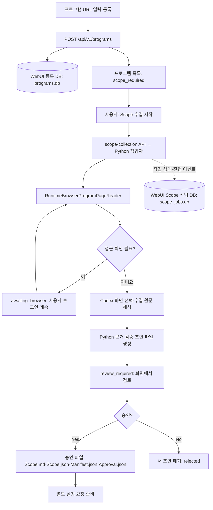

# 08. 대시보드와 CLI의 관계

**질문:** WebUI의 URL 등록·Scope 수집·승인·스캔 실행은 어떻게 나뉘며, 각 결과는 어떤 DB나 파일에 저장되는가?

## URL 등록은 Scope 수집과 별도다

`registerProgram()`은 프로그램 URL과 공개·비공개 구분을 `POST /api/v1/programs`로 보내 **등록만** 수행한다. Python 서버는 HTTPS URL을 검증·정규화하고 프로그램 식별 정보와 함께 `result/.webui/programs.db`에 저장한다. URL 등록 자체는 Codex 호출이나 대상 스캔을 시작하지 않는다. 새 등록의 응답 상태는 기본 `scope_required`다. [프런트엔드 등록](../../WebUI/src/App.tsx), [등록 API](../../src/aidast/web/server.py), [등록 DB](../../src/aidast/web/programs.py)

`programs.db`에는 Scope 작업 상태 열이 없다. 화면의 `scope_status`는 기본값과 `scope_jobs.db`의 현재 작업 상태를 결합한 응답이다. `private`도 등록 구분과 목록 이름 표시를 위한 값이며 브라우저 로그인 계정이나 암호를 뜻하지 않는다. 비공개 프로그램도 URL은 등록 DB에 저장된다. [ProgramRegistry._public·list](../../src/aidast/web/programs.py), [프로그램 목록 API](../../src/aidast/web/server.py)

## 수집·검토·승인 흐름

그림은 **현재 화면이 보내는 기본 수집 요청**인 `login_mode=runtime-browser`, `identity=primary` 기준이다. API 요청 모델의 기본 `headless`는 별도 경로이며, 이름과 달리 기본 작업자에서는 native Codex 수집과 필요 시 Playwright 대체 수집을 사용한다. [화면 기본 요청](../../WebUI/src/lib/scope.ts), [ScopeCollectionRequest·수집 분기](../../src/aidast/web/scope_workflow.py), [CLI 기본 경로와 비교](02-scope-recon.md)

일반 운영 환경의 수집은 별도 Scope 작업자 프로세스에서 수행한다. Python Reader가 브라우저를 열고 실제 화면 클릭·텍스트 수집을 맡으며, Codex의 `choose_scope_view()`는 관측된 이동 후보 중 하나를 고른다. 수집한 원문은 `interpret_captured_scope()`로 오프라인 해석한다. 외부 정책 링크가 있으면 Python의 별도 공개 문서 Reader로 수집하고 필요한 해석을 보강한다. **Scope 화면 이동 판단과 전체 파이프라인 실행은 서로 다른 역할**이다. [작업자 연결](../../src/aidast/web/scope_workflow.py), [작업자 프로세스](../../src/aidast/web/scope_process.py), [화면·해석 호출](../../src/aidast/agents/main.py), [Reader](../../src/aidast/scope/reader.py), [참조 처리](../../src/aidast/scope/policy_references.py)

자동으로 프로그램 페이지에 접근하지 못하면 `awaiting_browser`로 기다린다. 사용자가 플랫폼 로그인·접근 확인을 마친 뒤 `/scope-browser-ready` 요청을 보내면 재개한다. `identity=primary`는 **프로그램 플랫폼의 지속 브라우저 프로필 이름**이며, 이후 대상 앱의 로그인과 별개다. 기본 프로필은 사용자 홈의 `.local/share/aidast/scope-sessions/<origin·identity 해시>/browser-profile/`에 저장하며 WebUI 등록 DB에 쿠키를 넣는 구조는 아니다. [접근 대기·재개](../../src/aidast/web/scope_workflow.py), [브라우저 프로필](../../src/aidast/scope/reader.py)

화면은 `/scope-job`에서 상태·이벤트를 조회하고 `review_required`이면 `/scope-draft`를 가져온다. 승인 요청에는 검토자 이름과 명시적 확인이 필요하다. 승인하면 Python이 초안의 근거·해시를 다시 검사하고 파일을 게시한다. 거절은 새 초안을 삭제해 `rejected`로 기록하며, 앞서 승인한 Scope 파일이 있다면 이를 지우지 않는다. [조회·결정 API](../../src/aidast/web/server.py), [화면 승인 입력](../../WebUI/src/App.tsx), [초안 승인](../../src/aidast/orchestration/scope.py), [기존 승인 보존 테스트](../../tests/test_scope_policy_refresh.py)

## 저장소를 정확히 구분하기

아래 경로는 **결과 루트 기준이며, WebUI가 시작하는 기본 통합 run의 배치**다. 기본 결과 루트는 `result`이며 WebUI 설정에서 바꿀 수 있다. 사용자 홈의 브라우저 프로필은 이 표의 결과 루트 밖에 있다. [서버 결과 루트](../../src/aidast/web/server.py), [launch 경로 전달](../../src/aidast/web/launch.py), [프로필 경로](../../src/aidast/scope/reader.py)

| 저장소 | 경로 | 저장 내용 |
| --- | --- | --- |
| WebUI 등록 DB | `.webui/programs.db` | URL·플랫폼·프로그램 식별자·공개/비공개 구분·등록 시각 |
| WebUI Scope 작업 DB | `.webui/scope_jobs.db` | 현재 작업 ID·상태·모델·초안/출력 경로·오류, 작업별 진행 이벤트 |
| Scope 초안 파일 | `.webui/scope-drafts/` 아래 임시 폴더 | `Scope.md`·`Scope.json`·`Manifest.json` |
| 승인 Scope 파일 | `Scope/<platform>/<program>/` 또는 그 아래 `revisions/<scopejob_id>/` | 초안 세 파일과 `Approval.json` |
| 실행 규칙 보강 캐시 | `.execution-requirements/<digest>.json` | 구버전 승인 원문에 대한 검증된 실행 규칙·헤더 해석 |
| WebUI 스캔 이벤트 DB | `.webui/events.db` | 스캔별 정제된 진행 이벤트와 상태 투영 이력 |
| 모델 호출 기록 DB | `logs/CodexCalls.db` | Scope 등을 포함한 모델 호출 상태·시간·사용량 등 메타데이터 |
| Recon 원본 DB | `Runs/<platform>/<program>/<scan_id>/Recon.db` | 정찰 관측과 Task 실행 이력인 `pipeline_runs` 등 |
| 자산 발견 후보 DB | 선택한 Scope 폴더의 `AssetDiscovery.db` | 자산 발견 과정의 후보·관측 |
| 공유 정책 예산 DB | `.policy-budgets/<program namespace 해시>.db` | 실행 규칙에 연결된 요청 한도·공유 예산 기록 |
| 후속 단계 공용 DB | `AttackRuns/<platform>/<program>/<scan_id>/Pipeline.db` | 복제한 Recon과 Attack·Chaining·Validation 등 후속 기록 |
| 사례별 보고서 DB | `ReportRun/<scan_id>/<case_id>/Report.db` | 확인된 사례의 보고서 문맥과 초안 기록 |

근거는 [등록 DB](../../src/aidast/web/programs.py), [Scope 작업 DB·파일](../../src/aidast/web/scope_workflow.py), [실행 규칙 캐시·공유 예산](../../src/aidast/scope/execution_rules.py), [이벤트 DB](../../src/aidast/web/projection.py), [모델 로그](../../src/aidast/core/model_calls.py), [실행 경로·자산 후보 DB](../../src/aidast/cli.py), [Task 실행 이력](../../src/aidast/recon/executor.py), [프로그램별 스캔 경로](../../src/aidast/pipeline/locations.py), [보고서 경로](../../src/aidast/reporting/auto.py)에 있다.

generic 보고서의 영어 초안은 `ReportRun/<scan_id>/en/<case_id>/` 아래에 저장한다. 독립 Attack·가져오기·재개 등의 경로는 보고서 루트와 파일 배치가 다를 수 있으므로 선택한 실행 경로를 구분한다. Recon Plan·Task의 전체 구조가 `Recon.db`에 저장된다는 뜻도 아니다. 현재 통합 CLI에서 Plan·Task 목록은 메모리 객체이고, `pipeline_runs`에는 Task ID·단계·상태 등 실행 이력을 남긴다. [보고서 언어별 경로](../../src/aidast/reporting/auto.py), [통합 CLI·독립 Attack](../../src/aidast/cli.py), [Recon 실행 큐·이력](../../src/aidast/recon/executor.py)

Scope 수집 진행 이벤트는 `scope_jobs.db`의 `scope_job_events`에 저장한다. 스캔 진행 이벤트용 `events.db`와 같은 DB가 아니다. Scope 작업 표는 프로그램별 현재 작업 하나를 유지하므로 `programs.db` 또는 작업 상태 표 자체를 승인 문서의 버전 저장소로 보면 안 된다. 승인 이력의 원본은 승인 파일과 revision 폴더다. [DB 구조·작업 교체](../../src/aidast/web/scope_workflow.py)

## 다시 수집할 때의 승인 버전

검증된 승인 Scope가 있고 `refresh=false`이면 기존 승인을 재사용한다. `refresh=true`로 다시 수집할 때 기존 기본 폴더가 있으면 새 작업 ID의 `revisions/<scopejob_id>/`에 새 승인본을 게시한다. 첫 수집에서 기본 폴더가 없으면 `refresh=true`여도 기본 폴더를 사용한다. 기존 파일을 덮어쓰는 구조가 아니다. 수집 중이거나 검토 대기인 작업이 있으면 중복 시작도 거부한다. [start·approve 처리](../../src/aidast/web/scope_workflow.py), [refresh 테스트](../../tests/test_scope_policy_refresh.py)

등록 프로그램의 승인 상세 화면은 승인 시각 등을 비교해 **가장 최근의 검증된 승인본**을 찾는다. 반면 실행용 `ApprovedScopeCatalog`는 기본 폴더와 승인된 revision들을 목록에 올리고, launch는 요청의 **`scope_id`로 선택된 버전**을 사용한다. 선택된 버전이 revision이면 `--scope-revision <scopejob_id>`를 CLI에 넘긴다. 따라서 “다시 수집했다”와 “그 새 버전으로 실행했다”는 별개다. URL만으로 Scope를 찾는 `catalog.resolve()`는 기본 폴더를 찾는 경로이므로, 모든 API가 자동으로 최신 버전을 선택한다고 설명하면 틀리다. [최신 승인 상세](../../src/aidast/web/scope_workflow.py), [실행용 목록·버전 선택](../../src/aidast/web/launch.py), [선택 revision 전달 테스트](../../tests/test_scope_policy_refresh.py)

## 승인 이후 스캔 실행

스캔 시작은 Scope 승인 이후의 별도 `POST /api/v1/scans` 요청이다. 요청에는 선택한 `scope_id`·대상·프로필·모델·한도·필수 입력 등이 담긴다. launch 서비스는 다음 준비를 거쳐 별도 프로세스에서 `python -m aidast run`을 호출한다. [화면 실행 요청](../../WebUI/src/App.tsx), [실행 API](../../src/aidast/web/server.py), [launch](../../src/aidast/web/launch.py)

1. 선택한 승인본의 네 파일과 자산 선택·시작 경계를 검사한다.
2. 승인 원문에 필요한 실행 규칙 해석·캐시가 있는지 확인하고 필수 헤더·입력·확인·상한을 검증한다.
3. 조건부 제외 자원의 준비 상태가 실행 가능한지 확인한다. 불확실성 advisory와 명시적 mandatory blocker의 차이는 [02. Scope와 Recon](02-scope-recon.md)을 본다.
4. 검증한 대상을 고정 인자 목록으로 만든 뒤 `shell=False`로 CLI 프로세스를 시작한다. 결과 루트와 모델 선택도 전달한다.

따라서 WebUI는 Scope 수집 API와 실행 관리 계층을 제공하고, 스캔의 Recon·Attack·Validation 등은 CLI와 같은 파이프라인을 사용한다. Scope 승인 버튼을 누르는 순간 그 전체 파이프라인이 시작되는 것은 아니다. [Scope 결정](../../src/aidast/web/scope_workflow.py), [ScanLaunchManager.launch](../../src/aidast/web/launch.py), [CLI](../../src/aidast/cli.py), [고정 인자 테스트](../../tests/test_web_dashboard.py)

## 상태 조회와 진행 표시의 의미

`DashboardProjector.locate_database()`는 해당 스캔이 들어 있는 DB를 찾는다. 명시적 DB 설정이 없다면 `AttackRuns`의 `Pipeline.db`, `Runs`의 `Pipeline.db`·`Recon.db`, `ValidationRuns`의 `Pipeline.db` 순서로 확인한다. 찾은 원본 DB는 읽기 전용으로 연다. WebUI가 별도로 쓰는 것은 이벤트·투영 저장소인 `.webui/events.db`다. **원본 읽기 전용**이라는 말은 대시보드가 모든 저장소에 쓰지 않는다는 뜻이 아니다. [DB 선택·연결·이벤트 저장](../../src/aidast/web/projection.py)

서버는 스냅샷 API와 스캔별 WebSocket 이벤트를 제공하며 저장된 이벤트 ID 이후부터 재생한다. 통합 DB가 생기기 전에는 Recon DB를, 원본 DB가 아직 없을 때는 launch 이벤트를 이용해 진행을 표시할 수 있다. 화면의 발견 URL·Attack 후보·Validation 확정·Report 초안도 서로 구분한다. 진행률은 단계와 Task 상태를 화면용으로 계산한 값이며 탐지 정확도나 취약점 발견률이 아니다. [투영·이벤트 재생](../../src/aidast/web/projection.py), [서버 WebSocket](../../src/aidast/web/server.py), [표시 구분](../../WebUI/src/App.tsx), [조회 테스트](../../tests/test_web_dashboard.py)

**확인된 구현 한계:** 실행용 `ApprovedScopeCatalog`는 revision과 네 파일 전체를 검증하지만, 상태 표시의 `_scope_info()`는 현재 기본 `Scope/*/*/Scope.json`만 탐색하고 Approval의 Scope ID·JSON 해시만 대조한다. revision으로 실행한 스캔에서는 화면의 Scope 승인·프로그램 정보·정책 예산 표시가 누락될 수 있다. 이 표시를 launch의 승인 검증과 동일한 검사로 해석하지 않는다. 이번 문서 감사에서는 코드를 수정하거나 해당 화면을 실제 실행해 재현하지 않았다. [두 검사의 차이](../../src/aidast/web/launch.py), [표시용 Scope 조회](../../src/aidast/web/projection.py)

`WebUI/`는 화면 구현이고 `src/aidast/web/`는 서버·launch·projection 계층이다. `aidast dashboard`는 현재 원격 인증이 없어 loopback 주소만 허용한다. 사용 방법과 화면 설명은 [WebUI README](../../WebUI/README.md)를 본다. [대시보드 바인딩 검사](../../src/aidast/cli.py)

## 확인할 질문

1. URL을 등록했을 때 어느 DB에 무엇이 저장되며, 아직 시작하지 않은 것은 무엇인가?
2. Scope 수집 진행과 스캔 진행 이벤트는 각각 어느 DB에 저장되는가?
3. 새 Scope를 승인한 후 실제 실행할 버전은 어떤 ID로 선택하는가?
4. 승인 상세 화면의 최신 버전 조회와 URL 기반 Scope 조회는 어떻게 다른가?
5. WebSocket 연결이 끊기면 어느 저장 기록으로 진행을 다시 읽는가?
