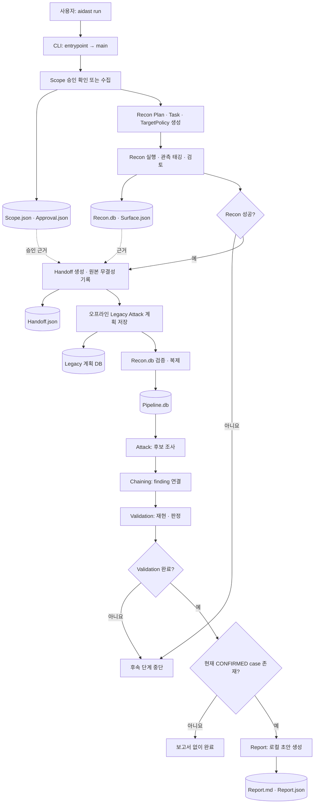

# 통합 파이프라인 지도

**질문:** `aidast run`에서 각 단계와 산출물은 어떻게 이어지는가?

## 읽는 법

- 사각형은 **작업**, 원통형은 **저장되는 산출물**, 마름모는 **다음 단계로 넘어갈 조건**이다.
- `Recon.db`는 원본 정찰 결과이며, 후속 단계는 검증·복제한 `Pipeline.db`를 사용한다. [파이프라인 생성 코드](../../src/aidast/pipeline/materialize.py)
- Legacy 계획은 Handoff 뒤에 저장되지만 `aidast run`이 자동 실행하는 Attack은 `Pipeline.db`를 사용하는 Native Attack이다. [CLI의 호출 순서](../../src/aidast/cli.py)
- `aidast run`의 단계 호출은 [CLI의 `_run_recon()`](../../src/aidast/cli.py)에 있다. Recon 실패가 있으면 후속 단계 호출을 시작하지 않는다.
- Report 생성 함수는 Validation이 완료됐을 때 호출되며, 현재 결정이 `CONFIRMED`인 완료 case만 초안을 만든다. [CLI](../../src/aidast/cli.py), [Report case 선택](../../src/aidast/reporting/auto.py)
- 실제 저장 경로와 결과 파일은 [README의 결과 폴더](../../README.md#결과-폴더)를 참고한다.

관련 설명: [01. 통합 파이프라인의 시작점](01-pipeline-entrypoints.md), [02~08 학습 순서](study-path.md).

## 확인할 질문

1. `Recon.db` 대신 `Pipeline.db`에 후속 단계 결과를 기록하는 이유는 무엇인가?
2. `Handoff.json`은 어떤 원본을 검증할 수 있게 해주는가?
