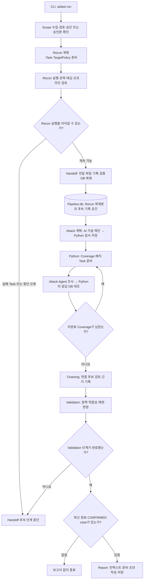

# 통합 파이프라인 지도

**질문:** Recon 결과는 언제 전달되며, 가설 계획과 실제 조사·판정은 어떻게 이어지는가?

이 그림은 현재 기본 `aidast run`의 **Native 주 흐름을 설명하기 위한 요약**이다. 정상 실행의 순서를 보여주며, 단계 내부의 재시도·사용자 접근 확인·모든 예외를 펼치지는 않는다. [CLI](../../src/aidast/cli.py)

## 단계와 산출물을 함께 읽기

| 단계 | 만들어지거나 사용되는 자료 | 저장소·파일 |
| --- | --- | --- |
| Scope | 허용 자산·정책 해석과 사용자 승인 | `Scope.md`, `Scope.json`, `Manifest.json`, `Approval.json` |
| Recon 준비·수집 | 메모리 Plan·Task, 대상별 정책, 관측과 도구 실행 이력 | `TargetPolicy.json`, `Recon.db`, `Surface.json`, `ReconReview.json` |
| Handoff | 전달할 파일 목록·역할·크기·해시와 DB 복제 | `Handoff.json`, 복제된 `Pipeline.db` |
| Native Attack | 가설·Coverage·Task·요청·시도·finding·재현 명세 | `Pipeline.db` |
| Chaining·Validation | 연결 근거, 재현 자료, case와 현재 결정 | 같은 `Pipeline.db` |
| Report | 현재 확정 case에 연결된 로컬 초안·컨텍스트 | case별 `Report.db`, `Report.context.json`, `Report.json`, `Report.md` |

근거: [CLI](../../src/aidast/cli.py), [Handoff 복제](../../src/aidast/pipeline/materialize.py), [Attack](../../src/aidast/orchestration/attack.py), [Chaining](../../src/aidast/orchestration/chaining.py), [Validation](../../src/aidast/validation/orchestration/coordinator.py), [Report](../../src/aidast/reporting/auto.py), [Report 저장](../../src/aidast/reporting/case_runtime.py).

Scope·Surface·Handoff 등의 JSON은 문서 파일이다. **정찰 원본 DB는 Recon.db, 후속 공용 DB는 Pipeline.db, 보고서 저장 DB는 별도 Report.db**다. WebUI 관리·진행 이벤트·모델 호출 DB는 [대시보드의 저장소 표](08-dashboard.md)에서 확인한다.

## 그림을 단순화하면서 빠뜨리면 안 되는 것

1. **Handoff는 Python의 전달 절차다.** 전달 파일을 검증하고 `Recon.db`를 복제해 후속 작업 공간을 만든다. 가설을 제안하거나 취약점을 판정하는 AI 호출로 설명하지 않는다. [Handoff](03-recon-handoff.md), [구현](../../src/aidast/pipeline/materialize.py)
2. **Native 가설 계획은 Handoff 이후의 Attack 작업이다.** 계획 AI는 저장된 관측을 분석하며 이 호출에서 실제 대상 요청을 수행하지 않는다. 조사 역할의 Attack Agent는 계획 뒤에 준비된 Task를 받는다. [계획 구현](../../src/aidast/attack/recon_hypotheses.py), [Agent 경계](07-agent-boundaries.md)
3. **위 그림은 CLI의 별도 Legacy 산출물을 생략했다.** 정확한 내부 순서는 Handoff 작성 → `legacy/Attack.db` 계획 저장 → `Pipeline.db` 생성 → Native Attack이다. Legacy 계획이 Native 가설이나 현재 조사의 finding인 것은 아니다. [CLI](../../src/aidast/cli.py), [Legacy 저장](../../src/aidast/attack/store.py)
4. **실행 결과는 조사 중 저장된다.** Attack Agent가 도우미를 사용해 남긴 finding·증거·재현 명세는 마지막 완료 응답보다 먼저 DB에 들어간다. 이후 Python이 응답과 실제 DB를 대조한다. [finding 저장](../../src/aidast/attack/db_cli.py), [완료 검사](../../src/aidast/orchestration/attack.py)
5. **끝난 작업과 성공한 증명은 다르다.** 건너뛴 작업, 증거 부족, 후보 없음도 단계 완료에 포함될 수 있다. 최종 확정은 Validation case의 판정이고 Report는 그중 최신 확정 case에 대한 로컬 초안이다. [상태와 재개](06-state-resume.md), [Report 선택](../../src/aidast/reporting/auto.py)

이 그림과 실행 조건 검사는 취약점 탐지율을 증명하지 않는다. 실제 도구 실행·모델 동작·발견 성능의 확인 범위는 [테스트 사례 추적](11-test-trace.md), 코드 진입점은 [코드 길잡이](system-overview.md)에서 구분한다.

## 확인할 질문

1. Recon의 관측 태깅·오프라인 검토와 Native Attack 가설은 어떤 점이 다른가?
2. Handoff에서 생성한 `Pipeline.db`에 어떤 단계가 이어 기록하는가?
3. Attack의 완료 표시만으로 모든 후보가 실제로 검사됐다고 말할 수 있는가?
4. 보고서가 하나도 없어도 완료된 실행일 수 있는 이유는 무엇인가?
