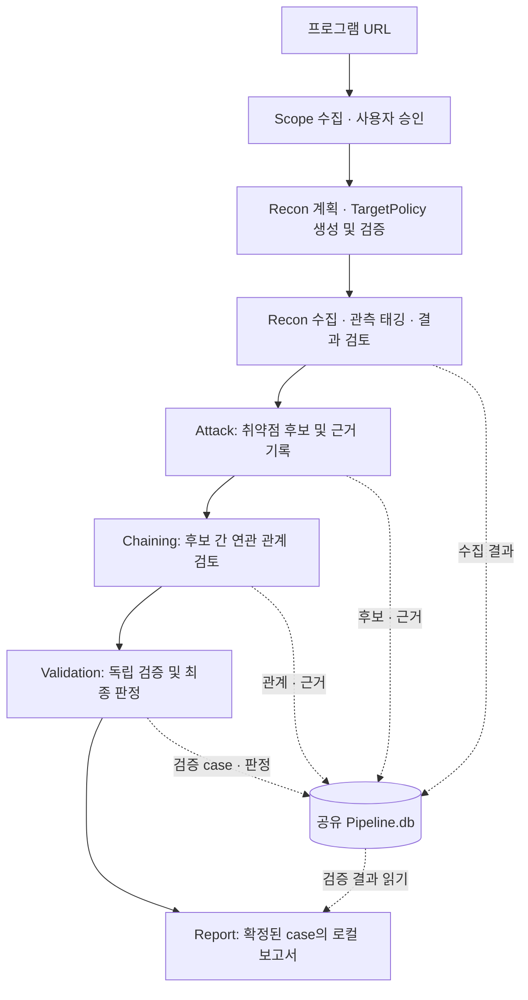

# AI DAST 아키텍처 및 파이프라인 핵심 정리

> 현재 소스 코드 기준 요약. README에 일부 남아 있는 이전 Handoff 방식과 현재 통합 실행 경로를 구분한다.

## 1. 프로젝트 개요

승인된 보안 테스트 범위를 바탕으로 웹 서비스의 구조를 수집하고, 취약점 후보와 연관 관계를 분석한 뒤 독립 검증과 보고서 작성으로 연결하는 Python CLI 프로젝트다.

핵심 구조는 **Python 실행 제어 + Codex 기반 AI 판단 + SQLite 공유 상태**다. Python 3.13 이상, Pydantic, Playwright를 사용하며, Codex CLI와 외부 탐색 도구를 연결한다.

## 2. 전체 흐름

통합 진입점인 `aidast run`은 Scope부터 Validation까지 순차 연결한다. **Report는 통합 실행에 자동 포함되지 않으며 별도 단계다.** Chaining 대상이 없으면 해당 단계는 건너뛰고 Validation으로 진행한다.

## 3. 구성요소별 책임

| 구성요소 | 핵심 역할 | 코드 위치 |
|---|---|---|
| CLI | 명령 해석, 단계 연결, 산출물 경로 관리 | `src/aidast/cli.py` |
| Main Agent | Codex 호출, Scope 해석, 계획·정책 제안, 단계별 AI 작업 연결 | `src/aidast/agents/main.py` |
| Coordinator | 선행 단계 확인, 작업 생성, 실행 결과와 DB 기록 검증 | `src/aidast/orchestration/` |
| Recon | 자산·서비스·엔드포인트 수집 및 관측 정규화 | `src/aidast/recon/` |
| Attack / Chaining | 취약점 후보, 시도 이력, 후보 간 관계와 근거 관리 | `src/aidast/attack/`, `src/aidast/chaining/` |
| Validation | 독립 재검증, 증거 관리, 규칙 기반 최종 판정 | `src/aidast/validation/` |
| Reporting | 검증 결과에 근거한 플랫폼별 로컬 보고서 작성 | `src/aidast/reporting/` |
| 공통 기반 | 요청 정책·예산 검사, 공유 DB 스키마, 단계 상태·감사 이력 | `src/aidast/core/`, `src/aidast/pipeline/` |
| Agent Skills | 역할별 지침, 출력 계약, 참고 자료 | `src/aidast/skills/` |

AI는 의미 해석과 분석을 담당하고, Python은 구조화된 출력 검증·정책 제한·상태 전이·최종 판정을 담당한다. 단계 간 전달은 주로 공유 DB의 식별자와 저장된 근거를 통해 이루어진다.

## 4. 단계별 핵심 동작

### ① Scope — 실행 범위 확정

- 프로그램 페이지에서 허용 자산과 정책을 수집하고 `Scope.md`와 구조화된 Scope를 만든다.
- 사용자가 초안을 승인하면 공식 산출물과 승인 기록을 저장한다.
- 이후에는 승인된 파일의 해시를 확인해 재사용한다. 선택한 자산과 정책을 바탕으로 `TargetPolicy.json`을 생성하고 Python이 검증한다.

### ② Recon — 서비스 구조 수집

- Main Agent가 계획을 만들고 `ReconCoordinator`가 의존 관계를 가진 작업으로 변환한다.
- `ReconExecutor`가 자산 유형과 정책에 따라 **자산 탐색 → DNS → 포트 → HTTP 응답 → 웹 origin → 엔드포인트 탐색**을 수행한다.
- subfinder·dnsx·naabu/nmap 등의 자산 도구와 Playwright·Katana·ffuf·API 추가 탐색을 연결한다. mitmproxy는 HTTP 관측과 정책 검사를 담당한다.
- 결과를 정규화하면서 원래의 관측 출처와 근거를 보존한다. AI가 관측에 기능 태그를 붙이고, 수집 후 Recon Agent가 저장 결과를 읽기 전용으로 검토한다.
- DB와 함께 `Surface.json`, `ReconReview.json`을 생성한다.

### ③ Attack — 취약점 후보와 근거 기록

- 완료된 Recon 상태와 관측 정보를 바탕으로 관련 Skill과 작업을 선택한다.
- Coordinator가 하나의 네이티브 Attack Agent를 연결하고, 후보·시도·요청 근거를 공유 DB에 저장한다.
- 반환된 결과의 scan·stage·식별자가 실제 DB 기록과 맞는지 확인한 뒤 단계를 종료한다.
- 이 단계에서 확인한 후보도 최종 보고 대상이 되려면 별도의 Validation을 거쳐야 한다.

### ④ Chaining — 후보 간 관계 검토

- Attack 시도에서 확인된 근거가 있는 finding을 입력으로 받는다.
- 후보 간 연결 관계, 관계를 검토한 이력과 근거를 저장한다.
- 입력 대상이 없으면 `skipped` 처리한다. 관계가 제안되었다는 사실만으로 최종 확정되지는 않는다.

### ⑤ Validation — 독립 검증과 판정

- finding 또는 입증된 chain을 검증 case로 만들고, 입력 근거의 무결성과 현재 정책을 검사한다.
- 재검증은 HTTP·브라우저·외부 관측(OOB)·chain용 실행 어댑터로 분리되어 있다.
- 기존 Attack 결론을 먼저 보여주지 않는 **blind assessment**를 고정한 뒤 원래 주장과 비교한다.
- Python `DecisionEngine`이 관측·영향·중복 여부·주장 충돌 등을 종합해 판정한다. 최종 상태는 `CONFIRMED`, `DISPROVEN`, `OUT_OF_SCOPE`, `KNOWN`, `UNDERPOWERED`, `BLOCKED`, `INCONCLUSIVE`, `CONTESTED`다.
- 검증 증거와 이력은 case에 추가 기록하며, 중단된 검증을 재개하는 경로도 제공한다.

### ⑥ Report — 확정 결과 문서화

- 현재 검증이 완료된 `CONFIRMED` case에서 로컬 보고서 초안을 생성한다.
- HackerOne·Intigriti·Bugcrowd 형식을 지원하며 `Report.db`, `Report.json`, `Report.md`를 만든다.
- 사실과 근거 ID의 연결을 검사하고, 원본 판정이 바뀌면 기존 보고서를 `stale`로 판별한다.
- `KNOWN`은 기존 case를 안내하고, `CONTESTED`는 검토 자료만 반환한다. 플랫폼 제출은 수행하지 않는다.

## 5. 데이터와 산출물

현재 통합 실행의 중심 저장소는 `Runs/<scan_id>/Pipeline.db`다.

| 데이터 묶음 | 대표 테이블 | 의미 |
|---|---|---|
| Recon | `assets`, `origins`, `endpoints`, `endpoint_observations`, `endpoint_annotations` | 자산·웹 서비스·경로·관측·AI 태그 |
| Attack | `attack_tasks`, `attack_attempts`, `findings`, `attack_http_requests` | 분석 작업·시도·취약점 후보·요청 이력 |
| Chaining | `chain_candidates`, `chain_executions`, `finding_chains` | 관계 후보·검토 이력·결과 |
| Validation | `validation_cases`, `validation_attempts`, `validation_evidence` | 독립 검증 단위·시도·증거 |
| 공통 상태 | `stage_runs`, `audit_events`, `credential_references` | 단계 상태·감사 이력·인증정보 참조 |

프로그램별 `Scope/<platform>/<program>/`에는 Scope 문서·JSON·Manifest·Approval을 보관한다. 통합 실행 폴더에는 `Pipeline.db`, `Surface.json`, `ReconReview.json`과 해당 실행에 사용한 Scope·Approval·TargetPolicy 사본을 둔다. 보고서는 별도로 지정한 출력 디렉터리에 저장한다.

## 6. 구조를 이해할 때 중요한 점

- **현재 경로와 호환 경로가 공존한다.** 통합 `run`은 공유 `Pipeline.db`를 사용한다. 기존 `Handoff.json → 별도 Attack.db` 기반 오프라인 검토 경로도 코드에 남아 있으므로 둘을 같은 흐름으로 읽으면 안 된다.
- **계획과 실행은 구분된다.** 기본 `recon`은 계획 생성이며, 실제 Recon 실행은 별도 선택이다. `run`은 후속 단계까지 연결하는 통합 실행이다.
- **정책은 실행 경계다.** 승인 Scope와 TargetPolicy를 기준으로 대상·메서드·요청량 등을 제한한다. Recon 프록시, Attack 요청 가드, Validation broker처럼 단계별 검사 경로가 있다.
- **단계 완료와 취약점 확정은 다르다.** `scans.completed`는 통합 흐름에서 Recon 완료를 뜻하며, 이후 단계 상태는 `stage_runs`, 최종 검증 결과는 `validation_cases`에서 확인한다.

소스 확인 시작점: [CLI 연결 흐름](../src/aidast/cli.py), [Recon 실행기](../src/aidast/recon/executor.py), [공유 스키마](../src/aidast/pipeline/schema.py), [Validation Coordinator](../src/aidast/validation/coordinator.py), [보고서 검증](../src/aidast/reporting/case_runtime.py).
