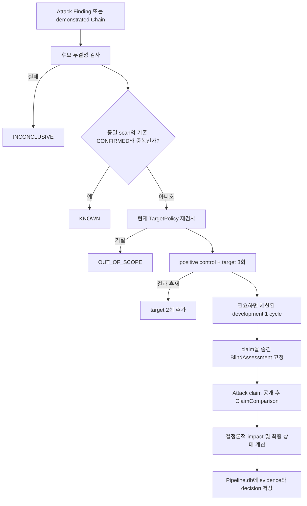

# Validation 구현 현황 이해 문서

- 기준일: 2026-09-13
- 관련 설계: [Validation 재구조화 설계](../superpowers/specs/2026-09-12-validation-refactor-design.md)
- 상세 계획: [Validation 재구조화 구현 계획](../superpowers/plans/2026-09-12-validation-refactor-implementation.md)
- 누적 변경 이력: [Validation 재구조화 변경 기록](VALIDATION_REFACTOR_CHANGES.md)
- 구현 커밋: `aab3221`, `3065ece`, `c5f5b8c`, `af85da6`, `0723fa8`

## 1. 무엇을 바꿨나

기존 Validation은 별도 `Validation.db`와 7개 질문 중심으로 동작했다. 현재 구현은
Recon, Attack, Chaining이 사용하는 `Pipeline.db` 안에서 후보의 출처, 재현 요청,
관찰 증거, Blind 판정, 영향도와 최종 상태를 함께 추적하는 구조로 전환하는 중이다.

핵심 목표는 다음 세 가지다.

1. Attack이 주장한 내용을 그대로 신뢰하지 않고 fresh replay로 다시 확인한다.
2. LLM이 요청 대상이나 최종 상태를 임의로 결정하지 못하게 데이터와 실행 권한을 분리한다.
3. 어떤 증거로 어떤 결론을 냈는지 hash와 DB 관계로 다시 검증할 수 있게 한다.

## 2. 전체 처리 흐름

`ValidationCoordinator`가 이 순서를 관리한다. 네트워크 실행은 `ReproductionPort` 뒤로
분리했고, LLM은 정제된 관찰 결과만 받는다. 최종 상태는 LLM 응답을 그대로 쓰지 않고
Python의 `DecisionEngine`이 정해진 우선순위로 계산한다.

## 3. Attack 후보를 Validation에 넘기는 계약

native Attack의 `commit-finding`은 다음 항목을 하나의 transaction으로 기록한다.

- Finding
- 근거가 된 Attack request와 attempt
- endpoint, method, payload template, parameter와 identity role
- TargetPolicy, Skill, request fingerprint에 묶인 immutable reproduction spec
- HTTP/browser/OOB target·positive control·negative control의 runtime 계약

이 중 하나라도 서로 맞지 않으면 Finding을 commit하지 않는다. Validation을 시작할 때
`CandidateIntegrityGate`가 completed Attack stage, confirmed attempt, Skill hash,
endpoint, request, policy digest, payload와 evidence 관계를 다시 검사한다. 이 검사가
실패하면 실제 요청을 보내지 않고 해당 case만 `INCONCLUSIVE`로 끝낸다.

runtime contract는 Attack이 실제 관찰에 사용한 target별 값에서 만든다. HTTP는 path/query,
비밀이 아닌 header, JSON 또는 text body와 bounded assertion을 정규화한 뒤 별도 SHA-256에
묶는다. Validation은 이 계약으로 요청을 만들고 status, header, body marker, JSON path,
duration assertion을 평가한다. browser 계약은 body 없는 navigation과 선언된 DOM selector,
URL·console assertion을 평가한다. OOB 계약은 attempt별 nonce로 callback token을 새로 만들고
observer를 arm한 뒤 policy-checked HTTP trigger를 전송하며 동일 token과 protocol의 event만
인정한다. 실제 응답·DOM·callback 값은 evidence에 원문으로 남기지 않고 hash와 요약으로
저장한다. contract나 configured executor/observer가 없으면 성공을 추정하지 않는다.

## 4. KNOWN 중복 판정

KNOWN은 payload 문자열 유사도, LLM이나 임베딩을 사용하지 않는다. 같은 scan 안의
현재 `CONFIRMED` case 중 아래 실행 메타데이터가 모두 정확히 같은 후보만 고른다.

- 취약점 유형(`vuln_class`)
- 정규화된 endpoint template
- HTTP method
- injection 위치
- parameter 이름과 실행 역할
- 필요한 identity/권한 역할
- Hunt Skill

현재 schema에는 별도 `parameter_role`이 없으므로 `(injection_location, parameter_name)`
조합을 parameter의 실행 역할로 사용한다. identity/권한 조건은 정렬한
`required_identity_roles`로 비교하며 role의 선언 순서는 의미로 취급하지 않는다. 여러
source가 모두 맞으면 case ID lexical 순으로 하나를 선택한다. signal 종류와 Validation
profile hash는 검증 방식의 속성이므로 KNOWN 중복 key에 포함하지 않는다.

payload normalization과 구조 hash는 reproduction spec의 변조 검출에만 유지하며 KNOWN
판정에는 사용하지 않는다. 이 단계는 현재 구조화된 메타데이터에 대한 기본 중복 검사이며,
payload의 semantic 동등성을 판정하는 LLM 단계는 아직 추가하지 않았다.

KNOWN의 source case가 이후 `CONFIRMED`가 아니게 되면 이를 참조하던 KNOWN case도
자동으로 `INCONCLUSIVE`가 된다.

## 5. replay와 Blind LLM 판정

각 Hunt Skill에는 machine-readable Validation profile이 있다. packaged non-chain
Hunt Skill 58개 모두에 fresh replay가 입증해야 할 보안 효과, control의 목적, impact
판정 규칙과 허용 가능한 development action을 정의했다.

일반적인 replay batch는 positive control 1회, negative control 1회, target 3회다.
target 결과가 섞이면 2회를 더 실행한다. credential 갱신이나 second identity 준비처럼
profile이 허용한 blocker 해결은 한 cycle에서 최대 두 action까지만 가능하다.

Blind pass에서는 Attack의 결론과 영향 주장을 숨기고 다음 정보만 LLM에 준다.

- 검증된 Skill과 Validation profile
- endpoint, method, payload 구조와 identity role
- control 및 fresh target의 정제된 observation

`BlindAssessment`가 schema와 hash를 포함한 evidence로 고정된 뒤에만 Attack claim을
공개한다. 같은 LLM 세션에서 `ClaimComparison`을 생성해 두 판단 사이의 의미 충돌을
확인한다. schema가 잘못되면 한 번의 수정 기회를 주고, 다시 실패하면 해당 case만
`INCONCLUSIVE`로 격리한다.

기본 Validation 모델은 `gpt-5.6-sol`이다. native Codex 세션은 read-only sandbox에서
shell, web, browser, apps 등 모든 도구를 끈 상태로 실행한다. 첫 Blind pass에서 얻은
thread ID는 같은 case의 unblind pass와 schema 수정 재시도에만 사용한다. 다음 case는 새
thread와 작업 directory에서 시작하므로 이전에 공개된 claim이 Blind 문맥에 섞이지 않는다.
KNOWN이나 무결성 실패로 replay가 필요하지 않으면 Codex 세션도 만들지 않는다.

## 6. 최종 상태와 impact

주요 종결 상태의 의미는 다음과 같다.

| 상태 | 의미 |
|---|---|
| `CONFIRMED` | 3회의 target 관찰이 모두 성공했고 control, 의미 일치, impact 기준을 통과 |
| `KNOWN` | 같은 scan의 유효한 `CONFIRMED` case와 결정론적으로 중복 |
| `DISPROVEN` | exploit이 아니라는 명시적 관찰 증거가 있음 |
| `OUT_OF_SCOPE` | 현재 TargetPolicy가 endpoint 또는 method를 허용하지 않음 |
| `UNDERPOWERED` | 취약점 효과는 확인됐지만 현재 입증된 기술 영향이 최소 기준보다 낮음 |
| `CONTESTED` | Blind 관찰과 Attack claim이 충돌하지만 Attack 쪽 positive evidence도 존재 |
| `INCONCLUSIVE` | 무결성, control, 관찰 횟수, schema 또는 원인 식별이 충분하지 않음 |

impact는 Boundary, Sensitivity, Actor requirements 세 축을 각각 0~3점으로 계산한다.
합계로 INFO부터 CRITICAL까지 severity를 만들며, Boundary 또는 Sensitivity가 0이거나
합계가 3 미만이면 `UNDERPOWERED`다.

이 점수는 기술 영향만 나타낸다. 설치 수, 사용자 수, 개별 버그바운티 프로그램의
eligibility와 보상 규칙은 포함하지 않는다. 따라서 설치 수에 따라 접수 여부가 달라지는
규칙은 별도 프로그램 정책 계층에서 판단해야 한다.

## 7. 요청 안전성과 증거 저장

`ValidationRequestBroker`는 initial request와 redirect hop마다 current TargetPolicy,
stage/case/attempt 소유권, rate, concurrency와 총 요청 예산을 dispatch 직전에 검사한다.
ledger에는 query 값과 credential header 값을 저장하지 않는다. evidence metadata도 secret,
민감 header, raw body를 제거하고 깊이, 항목 수와 바이트 크기를 제한한다.

Validation case, attempt, evidence, HTTP ledger, development action, impact hypothesis와
reproduction spec은 shared `Pipeline.db` schema v9에 저장된다. case update에는 optimistic
concurrency를 적용하고, reproduction spec은 trigger로 update와 delete를 막는다.

## 8. 중단 복구와 Chain Validation

stage가 중단되면 진행 중 attempt는 `outcome_unknown`, case는 `interrupted`로 남긴다.
같은 `stage_run_id`로 resume할 수 있으며, 완료된 replay batch와 이미 고정된
BlindAssessment/ClaimComparison은 hash와 참조를 검증한 뒤 재사용한다. 이 경우 요청과
Blind assessment를 다시 실행하지 않는다.

demonstrated Chain은 모든 node의 최신 상태가 `CONFIRMED` 또는 `KNOWN`일 때만 별도
end-to-end replay를 수행한다. node 순서, 단계 사이 binding, 마지막 terminal assertion과
각 reproduction spec을 검사한다. 이전 응답과 실제 binding 값, terminal impact claim은
Blind assessment 전까지 숨긴다. 최종 impact는 node 점수를 더하지 않고 terminal effect를
기준으로 다시 계산한다. Validation은 기존 Chaining 테이블을 수정하지 않는다.

## 9. Reporting과 CLI

case 기반 Report.db v2는 완료된 최신 `CONFIRMED` case만 신규 보고서 입력으로 허용한다.
보고서는 `scan_id`, `case_id`, decision hash와 정렬된 evidence hash에 묶인다. decision이
바뀌면 기존 artifact를 삭제하지 않고 `stale`로 표시한다. KNOWN은 source case를 안내하고,
CONTESTED는 review 용도로만 취급한다.

shared CLI에는 다음 계약이 연결돼 있다.

- `validate run Pipeline.db --scan-id ...`
- finding 또는 chain targeted run
- `validate resume Pipeline.db --stage-run-id ...`
- `validate status --scan-id/--case-id ...`
- `report run Pipeline.db --case-id ...`

`aidast run`은 Chaining 직후 DB 옆 `TargetPolicy.json`과 generic HTTP adapter로 native
Coordinator를 만들어 Validation을 자동 실행한다. 독립 `validate run/resume`도 `--policy`
또는 DB 옆 정책 파일로 같은 구성을 사용한다. application이 넣는 Coordinator 경계도
테스트 transport와 별도 운영 adapter를 위해 유지한다.

## 10. 아직 남은 작업

현재 저장 구조, 상태 머신, 무결성 검사, Blind Agent, Chain replay와 보고서 연결은
구현돼 있다. 실제 운영 경로를 완성하려면 다음 작업이 남아 있다.

1. 실제 target에서 동일 proof를 적용한 fresh negative control이 clear인지 수용 검증

HTTP response marker와 정량 threshold는 공통 profile에서 추정하지 않고 Attack의 실제
관찰에서 만들어진 immutable runtime contract로 받는다. generic HTTP adapter는 이 값이
있는 unauthenticated Finding을 기본 경로에서 결정론적으로 실행한다. contract가 없거나
`keyring://`/`vault://` reference가 필요한 Finding, Chain은 요청 없이 case 단위
`INCONCLUSIVE`가 된다. `env://NAME`은 환경 변수의 JSON header map을 요청 직전에만
해석해 authenticated HTTP replay를 지원한다. Playwright browser request는 current policy와
Validation ledger를 매 요청 통과한다. HTTP Chain과 HTTP→Browser/OOB terminal Chain은
명시적 응답 추출/요청 주입 계약으로 fresh 값을 전달한다. OOB callback은 설정 기반 HTTP
arm/cursor/poll observer로 연결한다.
중단 시 `outcome_unknown` 실행이 하나라도 남은 case는 자동 재전송하지 않고
`INCONCLUSIVE`로 닫아 원격 side effect의 중복을 막는다.

runtime contract 저장 전과 replay 전에는 profile-aware 최소 의미 검사를 수행한다. 동일한
target/negative request, status-only HTTP proof, duration 없는 timing proof, 실행 marker 없는
XSS와 동일한 OOB trigger는 거부한다. 실제 marker가 target의 자연 응답에도 존재하는지는
정적 규칙으로 추측하지 않고 fresh control 관측에서 판단한다. 이때 negative control은
target과 동일한 content marker·duration threshold·DOM/console assertion 또는 OOB callback
기준을 사용해야 하므로 무관한 assertion으로 baseline 검사를 우회할 수 없다.

native HTTP·Browser·OOB·Chain adapter의 성공 관찰은 Validation request ledger row를 반드시
남긴다. Coordinator는 evidence 저장 전에 반환된 모든 request ID가 현재
scan·stage·case·attempt에 속한 완료 row인지 다시 확인한다.

## 11. 설계와 달라진 부분

### Agent 요청 권한

설계는 Validation Agent에 제한된 request helper를 제공하는 형태를 설명한다. 구현에서는
Agent 도구를 모두 제거하고 Coordinator가 고정한 batch를 trusted `ReproductionPort`로
먼저 실행한다. LLM이 대상, payload, 요청 시점과 횟수를 선택하지 못하게 해 실행 권한을
더 좁혔다.

### Codex session 보존

같은 Agent가 Blind와 unblind를 이어서 처리하려면 persisted Codex thread가 필요하므로
native 실행에 `--ephemeral`을 사용하지 않는다. thread는 case 내부에서만 resume하며
다음 case와 프로세스 재시작에는 재사용하지 않는다. 고정된 BlindAssessment를 resume할
때는 새 thread에서 unblind comparison만 수행한다. thread ID는 Pipeline DB에 저장하지
않고 작업용 case별 staging directory는 stage 종료 시 정리한다. Codex CLI가 자체적으로
보존하는 로컬 session의 삭제 주기는 Codex 운영 정책을 따른다.

### profile의 runtime assertion

58개 profile의 보안 효과, control, impact 기준과 허용 HTTP/Browser/OOB 실행 계열은
strict schema로 고정했지만 selector, marker와 threshold는 공통값으로 만들지 않았다.
실제 target과 Attack runtime slot을 모르는 상태에서 이를 추정하면 정상 오류나 지연,
markup을 exploit 성공으로 오인할 수 있어서다. 대신 Finding은 Attack이 작성한 target별
runtime contract를 schema와 hash로 고정해 해당 실행 계열의 adapter에서 평가한다.

### legacy Reporting 제거

새 case 기반 Report.db v2가 기본 경로가 된 뒤 기존 Validation.db, 7 Question API,
`validation_id` 기반 Report.db v1 reader를 제거했다. 과거 DB는 자동 이관하지 않으며
현재 CLI는 shared Pipeline.db의 `scan_id` 또는 `case_id`만 받는다.
