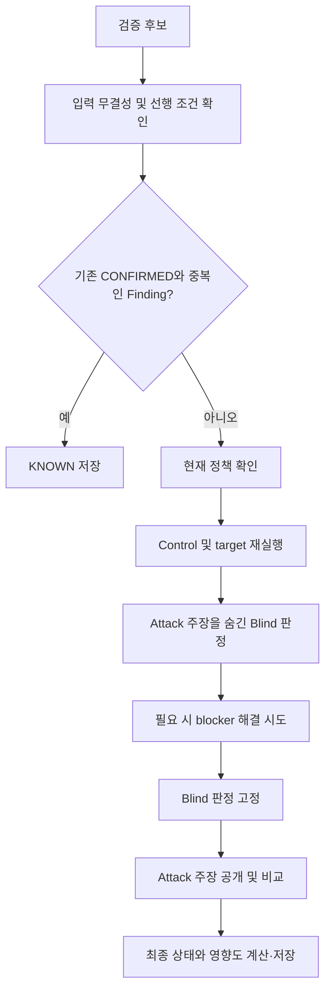
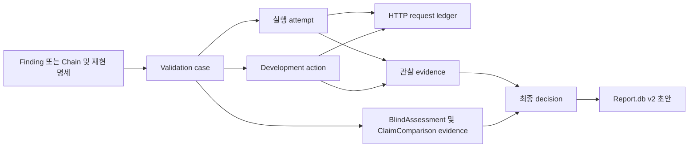

# Validation 구현 설명서

- 작성 기준: 2026-09-15
- 예시의 URL·관찰·점수는 설명용 가정이며 실제 스캔 결과가 아니다.

## 목차

1. [한눈에 보는 Validation](#overview)
2. [검증 대상과 입력 조건](#inputs)
3. [후보 하나가 검증되는 과정](#walkthrough)
4. [최종 판정 규칙](#decisions)
5. [재현 방식별 동작](#runtimes)
6. [실행 통제와 증거 관리](#controls)
7. [저장·중단 복구·보고서](#persistence)
8. [실행 방법과 현재 제약](#operations)
9. [부록 A. 코드 위치 안내](#code-map)
10. [부록 B. 용어 정리](#glossary)
11. [부록 C. 관련 문서](#references)

<a id="overview"></a>

## 1. 한눈에 보는 Validation

Validation은 앞 단계에서 발견한 취약점 후보를 다시 확인하는 단계다.
“취약점을 찾았다”는 기존 주장과 새로 관찰한 결과를 비교하고, 정해진 규칙에 따라 결론을 저장한다.
요청이 한 번 성공했다는 이유만으로 취약점을 확정하지는 않는다.

이 프로젝트의 단계 이름은 다음처럼 읽으면 된다.

- **Recon(정찰)**: 검사할 경로와 입력 지점 등 대상 정보를 모으는 단계.
- **Attack(취약점 탐색)**: 취약점 후보인 **Finding**과 그 근거를 기록하는 단계.
- **Chaining(연결)**: 여러 Finding을 순서대로 연결한 시나리오인 **Chain**을 만드는 단계.
- **Validation(검증)**: Finding 또는 Chain이 다시 재현되는지 확인하는 단계.
- **Reporting(보고서 작성)**: 검증에서 확정된 결과로 보고서 초안을 만드는 단계.

검증할 후보 하나를 **case**, 개별 실행 한 번을 **attempt**, 비교 실험과 검증 요청을
한 차례로 묶은 것을 **batch**라고 부른다. 예를 들어 case 하나의 첫 batch에는
비교 실험 2회와 검증 요청 3회, 총 5개의 attempt가 들어간다.

### 입력과 출력

| 구분 | 내용 |
|---|---|
| 입력 | Finding 또는 `demonstrated` 상태의 Chain(Chaining에서 시연된 시나리오), 재현 명세, 기존 증거 |
| 처리 | 저장된 정보가 서로 맞는지 확인 → 현재 허용 범위 확인 → 새 요청 실행 → 결과 해석 → 판정 |
| 출력 | 공용 DB인 `Pipeline.db`에 저장된 검증 상태, 새 관찰 증거, 판정 근거, 영향도 |
| 다음 단계 | `CONFIRMED`(취약점 확정) case로 보고서 초안 생성 |

### 누가 무엇을 결정하나

| 구성 요소 | 맡은 일 |
|---|---|
| ValidationCoordinator(진행 관리자) | 후보별 실행 순서와 재시도·저장·중단 복구 관리 |
| Runtime adapter(방식별 실행 담당) | 저장된 실행 명세에 따라 HTTP·브라우저·외부 수신 관찰(OOB)·Chain 실행 |
| Blind LLM(기존 주장을 보지 않는 해석 담당) | 민감정보를 제거한 새 관찰을 해석하고 영향도와 blocker(재현을 막는 조건) 파악 |
| DecisionEngine(최종 판정 코드) | 정해진 우선순위로 최종 상태 계산 |

LLM은 새 관찰을 해석하고, 이후 그 해석이 Attack의 주장과 일치하는지 비교한다.
요청 실행은 adapter가, 최종 상태 결정은 DecisionEngine이 맡는다.



흐름도는 정상 진행 경로를 요약한 것이다. 입력 오류가 있거나 정책에서 실행을 허용하지 않으면
해당 단계에서 종료한다. Chain은 구성 단계인 node의 검증 상태를 먼저 검사하며,
Finding처럼 기존 확정 결과와의 중복 여부를 검색하지 않는다.

### 현재 구현 범위

HTTP·Browser·OOB·Chain 재현, Blind 판정, DB 저장, 중단 복구, CLI와 Reporting이 연결돼 있다.

기본 CLI와 native builder에는 제한된 HTTP prerequisite resolver가 연결돼 있다. Blind LLM이
새 관찰에서 객관적인 blocker 축을 식별하면, resolver는 Attack이 Finding과 함께 변경 불가로
저장한 development contract 중 profile allowlist와 그 축에 맞는 action만 실행한다. 계약이
없거나 assertion이 실패하면 임의의 요청을 만들지 않는다. 더 앞선 판정 조건이 없고 blocker가
남으면 `BLOCKED`로 끝낸다. 애플리케이션은
필요하면 같은 port 계약의 별도 resolver를 명시적으로 주입할 수 있다.

요청 재실행(replay)에는 현재 검사 허용 범위인 Scope가 적용된다.
**특정 Attack 작업에만 따로 받은 승인(envelope)은 Validation의 실행 권한으로 이어지지 않는다**.
자세한 권한 조건은 8장에서 설명한다.

<a id="inputs"></a>

## 2. 검증 대상과 입력 조건

### Finding과 Chain

| 대상 | 의미 | 검증 초점 |
|---|---|---|
| Finding | Attack이 발견한 개별 취약점 후보 | 해당 요청으로 보안 효과가 다시 나타나는가 |
| Chain | 여러 Finding을 순서대로 연결한 시나리오 | 단계 간 값 전달을 포함해 최종 효과까지 재현되는가 |

대상을 지정하지 않으면 해당 scan(한 번의 전체 검사 묶음)의 `unreviewed`/`confirmed` Finding을
먼저 처리하고, `demonstrated` Chain을 다음으로 처리한다.
여기서 소문자 상태는 앞 단계의 기록이다. Validation이 내리는 최종 판정인 대문자 `CONFIRMED`와 구분한다.

### 후보에 필요한 데이터

Attack의 `commit-finding`(후보와 근거를 함께 저장하는 기능)은 다음 정보를 한꺼번에 기록한다.
하나의 transaction으로 저장하므로 일부만 저장되고 나머지가 빠지는 것을 막는다.

- Finding과 근거가 된 request·attempt
- Endpoint, HTTP method, parameter, payload template, 필요한 identity role
- Policy·Skill·request fingerprint에 연결된 변경 불가 재현 명세
- Target, positive control, negative control의 구체적인 runtime contract
- 필요한 경우 blocker 보정용 요청과 성공 assertion을 담은 development contract

여기서 **Hunt Skill**은 취약점 종류별 검사 규칙 묶음이고, **profile**은 그 Skill의 검증 기준이다.
**Runtime contract(재현 계약)**는 후보 하나에 대해 어떤 요청을 보내고 무엇을 확인할지 적은 실행 명세다.
Profile이 공통 기준이라면 contract는 해당 후보의 구체적인 실행 내용이다.
Identity role은 실행에 필요한 사용자 역할(예: 일반 사용자)을 뜻한다.
Hash와 fingerprint는 내용이 같은지, 바뀌었는지 비교하는 식별값이다.

Validation의 `CandidateIntegrityGate`(입력 일관성 검사)는 Attack 단계가 완료됐는지,
성공한 실행 기록이 있는지, Skill 식별값과 요청·정책·입력값(payload)·증거가 서로 맞는지 확인한다.
맞지 않으면 요청을 보내지 않고 해당 case를 `INCONCLUSIVE`(판단 근거 부족)로 종료한다.

**성공 증거의 형식도 검사한다.** HTTP 상태 코드만 있는 proof, 지연 기준값이 없는 timing proof,
console 실행 marker가 없는 XSS proof 등은 허용하지 않는다. Target과 negative control은
동일한 marker·selector·threshold를 평가해야 한다.

Proof는 성공을 뒷받침하는 증거다. Marker는 확인할 표식, selector는 확인할 화면 요소를 고르는 조건,
threshold는 성공 여부를 가르는 기준값이다. 즉, 검증 요청과 비교 요청에 같은 잣대를 적용해야 한다.

### KNOWN: 이미 검증한 Finding인가

같은 scan의 현재 `CONFIRMED` case와 다음 항목이 모두 같으면 `KNOWN`으로 처리한다.

| 비교 항목 | 규칙 |
|---|---|
| 취약점·위치 | 취약점 유형, endpoint template, HTTP method 일치 |
| 입력 지점 | Injection 위치와 parameter 이름 일치 |
| 권한 조건 | 필요한 identity role 일치. 선언 순서는 무시 |
| 검증 대상 Skill | Hunt Skill 이름 일치 |

<a id="walkthrough"></a>

## 3. 후보 하나가 검증되는 과정

### 예시: 다른 사용자의 문서를 읽었다는 주장

Attack이 “일반 사용자 A가 `GET /documents/{id}`에서 사용자 B의 문서를 읽었다”고
주장한 Finding을 생각해 보자. 필요한 재현 계약과 credential reference가 저장돼 있다고 가정한다.
Credential reference는 비밀번호나 토큰 자체가 아니라, 실행할 때 인증정보를 가져올 위치를 가리키는 값이다.

### ① 후보와 재현 계약 확인

저장된 요청·증거·Skill·정책의 연결이 유효한지 검사한다.
기존 `CONFIRMED` Finding과 정확히 중복이면 여기서 `KNOWN`으로 끝낸다.

### ② 현재 정책 확인

Endpoint와 method가 현재 Validation 정책에 허용돼 있는지 확인한다.
예시의 문서 경로 또는 GET이 허용되지 않으면 `OUT_OF_SCOPE`다.

### ③ Control과 target 실행

Control은 결과를 해석하기 위한 비교 실험이고, target은 실제 취약점 후보를 확인하는 요청이다.
Assertion은 응답에서 확인할 조건을 뜻한다. 구체적인 요청과 assertion은
저장된 runtime contract에서 가져온다. 아래는 개념을 설명하는 예다.

| 실행 | 횟수 | 예시에서 확인할 내용 |
|---|---|---|
| Positive control | 1회 | 정상적으로 관찰할 수 있는 문서에서 기대한 신호가 보이는가 |
| Negative control | 1회 | 취약점이 발동하지 않는 비교 요청에서는 같은 신호가 나타나지 않는가 |
| Target | 3회 | A의 권한으로 B의 문서에 접근했을 때 보안 효과가 반복되는가 |

최초 target 결과가 성공·실패로 섞이면 target을 2회 더 실행한다.
이 추가 실행은 성공 횟수를 채워 `CONFIRMED`로 올리는 절차가 아니다. 판정 규칙은 4장에 정리했다.

### ④ Attack 주장을 숨긴 Blind 판정

LLM에는 Skill·profile, 요청 구조·권한 역할, 정제된 새 관찰을 전달한다.
이 시점에는 “다른 사용자의 문서를 읽었다”는 Attack의 결론과 영향 주장을 공개하지 않는다.

LLM은 `BlindAssessment`로 관찰의 의미, 재현 여부, blocker와 영향도 축별 점수를 제안한다.
`BlindAssessment`는 기존 주장을 보기 전에 작성하는 구조화된 판정 기록이다.
영향도 해석에는 LLM이 참여하지만 최종 상태와 점수 합산 규칙은 Python 코드가 적용한다.

### ⑤ 필요한 경우 blocker 해결 시도

이 절차를 문서와 코드에서는 **development**라고 부른다. 여기서는 기능 개발이 아니라,
재현에 필요한 조건을 갖추는 작업이라는 뜻이다.

예를 들어 인증 상태가 만료돼 재현이 막혔다면, Blind LLM은 401/403 등의 현재 evidence를
근거로 `identity_auth` blocker를 제출한다. Coordinator는 해당 축의 profile action과
Attack이 저장한 development contract를 함께 대조한다. 기본 native resolver는 둘이 정확히
일치할 때만 계약에 적힌 요청을 실행한다.

- 해당 blocker의 action을 최대 2개까지 순서대로 시도한다.
- 각 action은 origin-relative 단일 endpoint·method·request·credential role·assertion과 hash에 묶인다.
- 요청은 current TargetPolicy와 정확한 method/URL 경계를 다시 통과하며 redirect는 허용하지 않는다.
- 성공은 상태 코드만이 아닌 대상별 response assertion까지 모두 통과해야 한다.
- 하나가 성공하면 멈추고 control 각 1회·target 3회를 새로 실행한다.
- 최종 판정에는 새 batch의 관찰과 새 BlindAssessment를 사용한다.
- 이 재실행 batch에는 결과 혼재 시 2회를 추가하는 분기가 없다.

LLM은 blocker를 분석할 뿐 endpoint나 payload를 작성·수정하거나 요청을 직접 보내지 않는다.
저장된 계약이 없거나 profile과 다르거나 현재 정책이 거절하면 해당 action은 실패한다.
현재 native resolver는 이 계약으로 표현되는 same-origin HTTP setup/refresh만 수행하며,
임의 shell 작업이나 Browser/OOB setup은 자동으로 만들지 않는다.

### ⑥ Blind 판정 고정 후 Attack 주장 공개

BlindAssessment를 hash와 함께 고정한 뒤, 같은 case의 LLM 세션에 Attack 주장을 공개한다.
`ClaimComparison`은 새 관찰의 해석과 Attack 주장이 일치하는지 비교한다.
즉, 먼저 독립적으로 판단을 기록하고 나중에 기존 주장과 대조하는 순서다.

각 응답이 정해진 데이터 형식(schema)을 지키지 않으면 한 번 수정 기회를 준다.
다시 실패하면 해당 case를 `INCONCLUSIVE`로 종료한다.
다음 case는 새 LLM 대화(thread)와 작업 폴더에서 시작한다.

### ⑦ 최종 상태와 영향도 저장

예시에서 control이 적절하고 target 3회가 모두 성공했으며, blocker·의미 충돌 없이
영향도 기준도 통과했다면 `CONFIRMED`가 된다.
상태, 관찰 증거, 비교 결과와 영향도는 `Pipeline.db`에 연결해 저장한다.

<a id="decisions"></a>

## 4. 최종 판정 규칙

### 상태 이름부터 읽기

| 상태 | 쉬운 뜻 |
|---|---|
| `CONFIRMED` | 재현·증거·영향도 기준을 모두 통과해 취약점으로 확정함 |
| `KNOWN` | 같은 scan에서 이미 확정한 Finding과 중복됨 |
| `OUT_OF_SCOPE` | 현재 정책이 허용하는 검사 범위를 벗어남 |
| `INCONCLUSIVE` | 증거가 부족하거나 결과가 불안정해 결론을 내릴 수 없음 |
| `DISPROVEN` | 취약점이 아니라는 명시적인 관찰 증거가 있음 |
| `BLOCKED` | 재현을 막는 조건을 해결하지 못함 |
| `CONTESTED` | 새 관찰의 해석과 기존 Attack 주장이 충돌함 |
| `UNDERPOWERED` | 확인한 기술적 영향이 프로젝트의 최소 기준보다 낮음 |
| `DEVELOPING` | 재현을 막는 조건을 해결할지 처리하는 내부 상태. 최종 저장 상태는 아님 |

### 우선순위: 먼저 해당하는 조건으로 결정한다

다음 표는 `DecisionEngine`의 검사 순서다. Coordinator는 무결성·KNOWN·정책 등을
앞에서 처리하거나 schema 오류를 별도로 종료할 수 있다. Chain node 검사는 5장을 참고한다.

| 순서 | 조건 | 결과 |
|---|---|---|
| 1 | 후보 무결성 실패 | `INCONCLUSIVE` |
| 2 | 유효한 기존 CONFIRMED와 중복 | `KNOWN` |
| 3 | 현재 정책 거절 | `OUT_OF_SCOPE` |
| 4 | Positive control 실패 또는 negative control에서도 신호 발생 | `INCONCLUSIVE` |
| 5 | 명시적인 비취약 관찰 증거 존재 | `DISPROVEN` |
| 6 | 원인 불명 또는 환경 구성 문제 | `INCONCLUSIVE` |
| 7 | 해결 가능한 blocker가 남음 | Development 전에는 내부 상태 `DEVELOPING`, 처리 후에는 `BLOCKED` |
| 8 | Target 관찰이 정확히 3회 모두 성공한 상태가 아님 | `INCONCLUSIVE` |
| 9 | Blind 해석과 Attack 주장이 충돌하고 Attack 증거도 존재 | `CONTESTED` |
| 10 | 영향도 결과 없음 | `INCONCLUSIVE` |
| 11 | 기술 영향이 최소 기준 미달 | `UNDERPOWERED` |
| 12 | 위 조건에 해당하지 않음 | `CONFIRMED` |

`DEVELOPING`은 내부 상태다. Coordinator는 최종 저장 시 남아 있는 `DEVELOPING`을
`BLOCKED`로 바꾼다. 실행 가능한 계약이나 profile action이 없어 실제 해결 작업을 수행하지
못한 경우도 포함한다.

**신호가 보이지 않았다는 사실만으로 `DISPROVEN`이 되지는 않는다.**
명시적인 비취약 증거 없이 target이 모두 실패했다면 관찰 횟수·성공 조건에서 `INCONCLUSIVE`가 된다.
또한 control 실패는 명시적 비취약 증거보다 먼저 판정한다.

### 추가 replay가 있어도 CONFIRMED가 되지 않는 이유

다음은 다른 선행 판정 조건이 없고, development로 새 batch를 만들지 않은 경우다.

| 최종 target 관찰 | 판정 |
|---|---|
| 성공 / 성공 / 성공 | 의미 비교·영향도 검사로 진행 |
| 실패 / 실패 / 실패 | `INCONCLUSIVE` |
| 성공 / 실패 / 성공 → 추가 성공 / 성공 | 총 5회이므로 `INCONCLUSIVE` |

코드는 다수결을 사용하지 않는다. 5회 관찰이 최종 입력이면 모두 성공이어도
관찰 조건 검사에서 `INCONCLUSIVE`로 처리한다.

### Impact와 severity

BlindAssessment의 세 축 점수는 각각 0~3이다. 각 축의 해석 기준은 Hunt Skill의 profile에 있다.

| 축 | 해석 대상 |
|---|---|
| Boundary | 확인된 보안 경계 침범 |
| Sensitivity | 영향받은 데이터·기능의 민감도 |
| Actor requirements | 공격 주체에게 필요한 권한·조건 |

Python은 세 점수를 합산해 다음 severity를 계산한다.

| 합계 | Severity |
|---|---|
| 0~2 | INFO |
| 3~4 | LOW |
| 5~6 | MEDIUM |
| 7~8 | HIGH |
| 9 | CRITICAL |

Boundary 또는 Sensitivity가 0이거나 합계가 3 미만이면 `UNDERPOWERED`다.
예를 들어 `(2, 2, 1)`은 합계 5, MEDIUM이며 영향도 최소 기준을 통과한다.
최종 `CONFIRMED` 여부는 앞선 모든 조건도 통과해야 한다.

이 점수에는 설치 수, 사용자 수, 버그바운티 프로그램의 접수·보상 규칙이 포함되지 않는다.

<a id="runtimes"></a>

## 5. 재현 방식별 동작

Runtime adapter는 저장된 계약의 `runtime_kind`에 따라 선택된다.
`runtime_kind`는 HTTP나 Browser처럼 실행 방식을 지정하는 값이다.
Chain 전용을 제외한 58개 Hunt Skill의 profile은 검증할 보안 효과와 허용 실행 방식을 정의하고,
실제 marker·selector·threshold는 대상별 runtime contract가 정한다.

| 방식 | 실행 방법 | 확인하는 증거 | 필요한 구성·제약 |
|---|---|---|---|
| HTTP | Path·query·header·body로 요청 재구성 | Status, header, body marker, JSON path, duration assertion | 기본 native adapter 제공. 상태 코드만으로 취약점 proof를 만들 수 없음 |
| Browser | Body 없는 navigation 실행 | DOM selector, URL, console assertion | Python Playwright와 Chromium 필요. XSS proof에는 console 실행 marker 필요 |
| OOB | Observer 준비 → HTTP trigger → callback 조회 | Attempt별 새 token 및 protocol과 일치하는 event | Observer 설정 필요. 다른 attempt의 callback은 성공 근거가 아님 |
| Chain | Node 순서대로 실행하고 단계 사이 값을 전달 | 마지막 단계의 terminal assertion과 effect | 중간 source step은 HTTP만 허용. Browser·OOB는 terminal step으로 사용 가능 |

### Chain은 node 성공과 전체 성공을 따로 확인한다

Node는 Chain을 구성하는 개별 단계다. Binding은 앞 단계에서 얻은 값을 다음 단계에 전달하는 연결이고,
terminal effect는 마지막 단계에서 확인하는 보안 효과다.

Node가 각각 검증됐더라도 Chain 전체가 자동으로 성공하는 것은 아니다.
단계 간 binding과 마지막 보안 효과를 포함한 end-to-end replay가 필요하다.

재현 전 node 상태 검사는 다음 우선순위를 따른다.

1. Node가 없으면 `INCONCLUSIVE`.
2. `DISPROVEN` node가 있으면 Chain도 `DISPROVEN`.
3. 다음으로 `OUT_OF_SCOPE`, `BLOCKED` node가 있으면 해당 상태 적용.
4. 미검증·`CONTESTED`·`UNDERPOWERED`·`INCONCLUSIVE` node가 있으면 `INCONCLUSIVE`.
5. 모든 node가 유효한 `CONFIRMED` 또는 `KNOWN`이면 계약 무결성 검사 후 전체 재현.

Chain의 영향도는 node 점수의 합이 아닌 **최종 효과**로 다시 계산한다.
이전 응답, 실제 binding 값, terminal impact claim은 Blind 문맥에서 숨긴다.
기존 Chaining 테이블은 Validation이 수정하지 않는다.

<a id="controls"></a>

## 6. 실행 통제와 증거 관리

### LLM은 관찰을 해석하고, 요청은 코드가 실행한다

Native Validation LLM은 read-only sandbox에서 shell·web·browser·apps 등 도구를 끈 상태로 실행된다.
즉, 기본 구현(native)의 LLM은 읽기만 허용된 격리 환경에서 전달받은 자료를 해석한다.
요청 대상과 payload, batch 순서는 Coordinator와 adapter가 다룬다.
LLM이 직접 네트워크 요청을 만들거나 최종 상태를 저장하지 않는다.

Case 내부의 Blind·unblind는 같은 thread를 사용하지만 다음 case에는 재사용하지 않는다.
중단 복구에서는 고정된 BlindAssessment로 새 thread에서 비교를 시작할 수 있다.

### 요청과 credential 경계

- 요청과 redirect hop에 정책을 적용하고 요청 예산·rate·concurrency를 검사한다.
- 요청 ledger를 통해 scan·stage·case·attempt 또는 development action의 소유권을 추적한다.
- Coordinator는 adapter가 인용한 request ID가 현재 실행의 `completed` row인지 다시 확인한다.
- Credential은 DB에 opaque reference로 저장하고 요청 시점에 해석한다.
- 기본 resolver는 `env://`와 `keyring://SERVICE/ACCOUNT`를 지원한다.
- 추가 secret backend는 trusted application이 주입해야 한다.

해석된 credential은 CR/LF가 없는 1~32개의 HTTP header map이어야 한다.
이는 인증정보를 헤더 이름과 값의 묶음으로 받으며, 값에 줄바꿈 문자가 들어가면 허용하지 않는다는 뜻이다.
Credential을 읽는 resolver와 blocker를 해결하는 `prerequisite_resolver`는 서로 다른 역할이다.
기본 prerequisite resolver는 development contract의 opaque credential role만 credential
resolver로 넘기고, 응답 원문 대신 status·길이·hash·assertion 결과만 evidence에 저장한다.

### 무엇을 증거로 남기나

실제 응답·DOM·callback 원문을 evidence에 그대로 저장하지 않고 hash와 정제된 요약을 남긴다.
Metadata의 secret·민감 header·raw body를 제거하고 깊이·항목 수·크기를 제한한다.
요청 ledger의 query 값도 가린다.

Hash와 DB 참조는 “어느 요청·관찰로 이 판단을 만들었는가”를 확인하는 데 사용한다.
Hash 자체가 취약점의 진위를 증명하는 것은 아니며, 진위 판단에는 새 관찰과 control이 필요하다.

<a id="persistence"></a>

## 7. 저장·중단 복구·보고서

### 주요 데이터 관계

현재 저장소는 공용 `Pipeline.db` schema v9다. 아래는 이해를 위한 관계 요약이다.



Case에는 상태와 처리 단계가, attempt에는 개별 실행 결과가 기록된다.
Development action과 impact hypothesis도 별도 저장한다.
Development action은 전제 조건을 해결하기 위해 수행한 작업이고, impact hypothesis는 영향에 대한 가설이다.
Case를 변경할 때는 저장된 버전을 확인해 서로의 변경을 덮어쓰지 않도록 한다.
재현 명세는 DB에 등록된 자동 규칙(trigger)으로 수정·삭제를 막는다.

### 중단 후 무엇을 재사용하나

| 남아 있는 상태 | Resume 동작 |
|---|---|
| 완료된 replay batch | 증거와 참조 검증 후 관찰 재사용 |
| 고정된 BlindAssessment | Hash 검증 후 재사용, 새 thread에서 unblind 가능 |
| 저장된 ClaimComparison | Hash와 참조 검증 후 재사용 |
| 실행 결과가 불명확한 `outcome_unknown` | 자동 재전송하지 않고 `INCONCLUSIVE`로 종료 |

같은 `stage_run_id`로 resume한다. 중단된 case의 처리 단계는 `interrupted`,
진행 중 attempt는 `outcome_unknown`으로 남는다. 결과를 모르는 요청을 자동 재전송하지 않는 이유는
원격 상태 변경을 중복 실행할 수 있기 때문이다.

### KNOWN과 보고서의 유효성

KNOWN이 참조한 source case가 더 이상 `CONFIRMED`가 아니면 해당 KNOWN도
자동으로 `INCONCLUSIVE`가 된다.

신규 보고서 초안은 완료된 최신 `CONFIRMED` case만 입력으로 받는다.
보고서는 scan·case ID, decision hash, 정렬된 evidence hash에 연결된다.
Decision이 바뀌면 기존 파일을 지우지 않고 `stale`로 표시한다.
KNOWN은 원본 case를 안내하고, CONTESTED는 검토 대상으로 취급한다.

<a id="operations"></a>

## 8. 실행 방법과 현재 제약

### CLI 사용 예시

프로젝트 환경에 `aidast`가 설치돼 있다고 가정한다. 아래 ID는 실제 DB의 값으로 바꿔야 한다.

```bash
# Scan 전체 검증
aidast validate run Pipeline.db --scan-id scan_123

# Finding 또는 Chain 하나 검증
aidast validate run Pipeline.db --scan-id scan_123 --finding-id finding_123
aidast validate run Pipeline.db --scan-id scan_123 --chain-id chain_123

# 중단된 stage 재개
aidast validate resume Pipeline.db --stage-run-id stage_123 --policy TargetPolicy.json

# 결과 조회
aidast validate status Pipeline.db --scan-id scan_123
aidast validate status Pipeline.db --case-id case_123

# CONFIRMED case로 로컬 보고서 초안 생성
aidast report run Pipeline.db --case-id case_123 --platform hackerone --output-dir ReportRun
```

`--finding-id`와 `--chain-id`는 함께 사용할 수 없다. Status는 scan 또는 case 중 하나를 선택한다.
Run·resume에서 `--policy`를 생략하면 DB 옆 `TargetPolicy.json`을 사용한다.
전체 `aidast run`은 Chaining 직후 native Validation을 실행한다.

### 실행 환경

| 항목 | 필요한 구성 |
|---|---|
| 공통 | Pipeline.db, 유효한 TargetPolicy.json, 후보의 재현 계약 |
| Blind LLM | Native Codex 실행 환경과 로그인. 기본 Validation 모델은 `gpt-5.6-sol` |
| HTTP | 기본 native adapter 사용. 인증이 필요하면 credential reference 구성 |
| Browser | Python Playwright와 Chromium |
| OOB | `AIDAST_OOB_OBSERVER_CONFIG`로 observer 구성. Arm/poll JSON endpoint는 HTTPS·동일 origin |
| Development | 기본 native HTTP resolver 사용. Finding에 유효한 development contract가 있어야 실행 |

계약이나 필요한 executor·observer·credential이 없으면 성공으로 대체하지 않는다.
Case preflight에서 `INCONCLUSIVE`로 처리할 수 있으며, 잘못된 전역 정책·observer 설정은
native Coordinator 생성 자체를 실패시킬 수 있다.

### 현재 알아야 할 제약

| 제약 | 실제 영향 |
|---|---|
| Development 계약 필수 | profile action만 있어서는 실행하지 않음. Attack이 exact same-origin HTTP 요청과 non-status assertion을 저장해야 함 |
| 기존 Finding 자동 보강 없음 | 기존 immutable reproduction spec의 null development contract를 추측해 채우지 않음. 새 Attack 결과가 계약을 생산해야 함 |
| HTTP development만 기본 지원 | shell·Browser·OOB setup이나 runtime/payload 재작성은 자동 수행하지 않으며 별도 trusted resolver가 필요 |
| 고위험 action 자동 거절 | DELETE, 결제·전송·메시지 등 high-impact path와 외부 origin은 task 승인과 무관하게 native development에서 실행하지 않음 |
| Attack 승인 envelope 비승계 | task별 사용자 승인이 필요했던 request는 독립 Validation replay 권한으로 사용하지 않음 |
| Browser·OOB는 Chain의 마지막 단계만 지원 | 중간 단계의 binding source로 사용할 수 없음 |
| 과거 Validation.db·Report v1 경로 제거 | 과거 DB 자동 이관을 제공하지 않음 |

### 남은 구현과 후속 검증

기본 native HTTP Developing과 Coordinator 연결은 구현됐다. 아래 항목은 현재
구현의 오류 목록이 아니라, 현재 경계 밖에 남은 확장 구현과 운영 수용
검증을 구분한 목록이다.

#### 확장 구현 과제

| 우선순위 | 항목 | 현재 동작 | 남은 구현·완료 기준 |
|---|---|---|---|
| P0 | Attack의 development contract 생성 커버리지 | Blind Agent는 관찰을 보고 blocker 축을 분석하지만, Developing은 Attack이 Finding에 미리 고정한 contract만 선택·실행한다. Attack은 exact request와 non-status assertion을 실제로 알 때만 선택적으로 contract를 저장한다. | 승인된 외부 test target에서 Attack이 지원 blocker별로 유효한 contract를 생산하는지 검증하고, 누락 패턴을 Skill·producer test로 보강한다. 요청을 즉석에서 추측해 실행하는 planner는 추가 승인·안전 설계 없이 도입하지 않는다. |
| P1 | Browser·OOB Developing resolver | 기본 resolver는 same-origin HTTP setup/refresh 요청 하나만 실행한다. | Browser 세션 복구와 OOB arm/setup에 대한 immutable contract, trusted executor, policy·ledger ownership, assertion 평가와 resume 테스트를 각각 구현한다. |
| P1 | 다단계·동적 setup workflow | Development action 하나는 고정된 요청 하나이며 response로 다음 요청을 재작성하지 않는다. | 단계별 contract와 scalar binding allowlist, 민감 값 비저장, 중간 실패·`outcome_unknown` 복구 규칙을 정의한 뒤 trusted resolver를 구현한다. 전체 action 상한은 현재 정책인 2개를 유지한다. |
| P1 | 고위험 action의 별도 승인 경로 | Native resolver는 `DELETE`, 결제·전송·메시지·webhook 경로와 외부 origin을 거절한다. Attack task의 기존 approval envelope도 승계하지 않는다. | Validation 전용 사용자 승인 DTO, 유효기간·대상·메서드 binding, one-shot 소비, audit ledger와 취소 절차를 설계·구현한 뒤에만 허용한다. |
| P2 | Chain의 Browser·OOB 중간 binding | Browser와 OOB는 terminal step으로만 실행할 수 있다. | DOM·callback 결과에서 후속 요청에 필요한 최소 scalar만 추출하는 contract와 증거 redaction·binding ownership 검증을 구현한다. |
| P2 | UNDERPOWERED 후속 연동 | `ImpactGapAnalyzer`는 후속 입증 가설과 `validation`·`chaining`·`manual` owner를 저장하지만 실행하지 않는다. | 가설을 새 Attack/Chaining 작업으로 명시적으로 인계하는 별도 workflow를 추가한다. 가설은 실행 전까지 Validation 증거·점수·판정에 사용하지 않는다. |
| P3 | 과거 데이터 이관 도구 | 기존 Finding의 null development contract, 과거 `Validation.db`, Report v1을 자동 보강·이관하지 않는다. | 운영상 필요가 확정될 때만 원본 불변과 dry-run·backup·audit 결과를 보장하는 명시적 migration command를 별도 설계한다. contract는 과거 증거에서 추측해 채우지 않는다. |

P0의 핵심은 resolver 등록 여부가 아니라 **실제 Attack 결과에 실행 가능한
development contract가 충분히 남는지**다. 계약이 없으면 기본 resolver가 등록돼
있어도 요청을 만들지 않고 `BLOCKED`로 종료한다.

#### 설계상 비목표

다음은 현재 MVP의 누락이 아니라 의도적으로 Validation의 책임에서 제외한
항목이다. 범위를 바꾸려면 먼저 재구조화 설계를 갱신해야 한다.

- Validation에서 새 취약점, payload 계열이나 chain을 탐색하는 기능
- 다른 scan·다른 Pipeline DB까지 확장한 KNOWN 검색
- `CONTESTED` 결과의 자동 재심과 사람 판정 대체
- 보고서의 외부 플랫폼 자동 제출
- Development 가설이나 추가 replay를 현재 impact·severity를 높이는 증거로 사용하는 동작

#### 운영 수용 검증 과제

| 우선순위 | 검증 | 완료 기준 |
|---|---|---|
| P0 | 외부 target 전체 E2E | 승인된 test target에서 Recon→Attack→development contract 생성→Chaining→Validation→Reporting이 하나의 Pipeline DB로 완료되고 비종결 case가 남지 않음 |
| P0 | 실제 Codex Blind/Unblind | fixture Agent가 아닌 실제 Codex CLI가 staged allowlist만 보고 schema·evidence binding을 지키며 assessment와 comparison을 생성함 |
| P1 | Local live acceptance | `AIDAST_LIVE_ACCEPTANCE=1`로 실제 HTTP socket, control, target 3회, Developing, ledger와 최종 snapshot을 검증하고 skip 없이 통과함 |
| P1 | 전체 test suite | Reporting Agent test에 필요한 `pytest`를 개발 의존성으로 준비하고 전체 suite가 수집 오류·skip·assertion 실패 없이 통과함 |

Validation의 정책 확인, 실행 관리, redirect(다른 URL로 이동), 브라우저 요청에는
공통 검사 함수인 `allows_validation_url()`이 적용된다. 권한 조건은 다음처럼 읽으면 된다.

- 안전 메서드: Recon과 Attack의 현재 허용 목록 양쪽에 포함돼 있어야 한다.
- 상태 변경 메서드: Scope의 `active_non_destructive` 권한(비파괴적 능동 검사 허용)과
  `attack_allowed_methods`(Attack에서 허용한 HTTP 메서드 목록)를 모두 만족해야 한다.
- 기존 요청의 권한 기록: `scope_active_mutation`은 Scope에 근거해 상태 변경 요청을 실행했다는 표시다.
  이 기록은 재실행의 근거가 될 수 있지만 현재 정책 검사도 통과해야 한다.
- 개별 작업 승인: `approved_envelope`는 특정 Attack 작업에 따로 받은 승인에 의존했다는 표시다.
  이 승인은 Validation에 자동으로 이어지지 않는다.
- 권한 근거가 없는 과거 기록: 어떤 허가로 실행했는지 나타내는 provenance(출처 기록)가 없으면
  입력 검사에서 중단한다. 이처럼 허용 근거가 불확실할 때 실행을 막는 방식을 fail-closed라고 한다.

### 테스트로 확인한 범위

아래는 2026-09-15 native Developing 구현 후 실행한 기록이다. 실행 위치는
`recon-attack-pipeline/`다.

| 명령 | 결과 |
|---|---|
| `TMPDIR=/private/tmp .venv/bin/python -m unittest discover -s tests -p 'test_validation*.py' -q` | 115개 중 114개 통과, live acceptance 1개 생략 |
| `TMPDIR=/private/tmp .venv/bin/python -m unittest tests.test_recon_policy tests.test_request_broker tests.test_native_attack_orchestration -q` | 47개 통과 |
| `TMPDIR=/private/tmp .venv/bin/python -m unittest discover -s tests -p 'test_shared_validation_reporting.py' -q` | 3개 통과 |
| `.venv/bin/python -m compileall -q src tests` | 통과 |

전체 unittest는 419개 테스트 실행 중 코드 assertion 실패는 없었지만 개발 의존성 `pytest`가
설치되지 않아 `test_reporting_agent.py` 모듈 수집 1건이 실패했다. 외부 target E2E와 실제 Codex
CLI 호출은 이 구현 작업에서 재검증하지 않았다.

별도의 local live acceptance는 `AIDAST_LIVE_ACCEPTANCE=1`에서 활성화된다.
실제 HTTP socket·control·target 3회·ledger·최종 snapshot을 검사하지만,
저장된 Attack 계약에서 시작하고 판정 Agent를 fixture로 주입한다.
따라서 외부 target에서 Recon부터 계약 생성, 실제 LLM 호출까지 이어지는 전체 운영 검증은 별도로 필요하다.

<a id="code-map"></a>

## 부록 A. 코드 위치 안내

먼저 Coordinator를 보고, 궁금한 단계의 모듈로 이동하면 된다.

| 궁금한 내용 | 코드 |
|---|---|
| 전체 실행 순서·개발 action·복구 | [coordinator.py](../../../src/aidast/validation/coordinator.py) |
| 최종 상태 우선순위 | [decision.py](../../../src/aidast/validation/decision.py) |
| 영향도 계산 | [impact.py](../../../src/aidast/validation/impact.py) |
| 후보 무결성과 KNOWN | [integrity.py](../../../src/aidast/validation/integrity.py), [matching.py](../../../src/aidast/validation/matching.py) |
| Proof 의미 검사 | [runtime_semantics.py](../../../src/aidast/validation/runtime_semantics.py) |
| Development 계약과 native resolver | [development.py](../../../src/aidast/validation/development.py) |
| Native 구성과 adapter 선택 | [native.py](../../../src/aidast/validation/native.py), [runtime_adapter.py](../../../src/aidast/validation/runtime_adapter.py) |
| HTTP·Browser 재현 | [http_adapter.py](../../../src/aidast/validation/http_adapter.py), [browser_adapter.py](../../../src/aidast/validation/browser_adapter.py) |
| OOB·Chain 재현 | [oob_adapter.py](../../../src/aidast/validation/oob_adapter.py), [chain_adapter.py](../../../src/aidast/validation/chain_adapter.py) |
| Blind 입력과 LLM 실행 | [blind.py](../../../src/aidast/validation/blind.py), [codex_runner.py](../../../src/aidast/validation/codex_runner.py) |
| 요청·증거·credential 경계 | [request_broker.py](../../../src/aidast/validation/request_broker.py), [evidence_policy.py](../../../src/aidast/validation/evidence_policy.py), [credentials.py](../../../src/aidast/validation/credentials.py) |
| DB 저장과 조회 | [repository.py](../../../src/aidast/validation/repository.py), [status.py](../../../src/aidast/validation/status.py) |
| 보고서와 CLI | [case_runtime.py](../../../src/aidast/reporting/case_runtime.py), [cli.py](../../../src/aidast/cli.py) |

<a id="glossary"></a>

## 부록 B. 용어 정리

프로젝트 단계·데이터·코드 이름을 중심으로 정리했다. 일반 기술 용어도 이 문서에서 쓰는 의미를 함께 적었다.

| 용어 | 이 문서에서의 뜻 |
|---|---|
| Scan / stage / stage_run_id | 전체 검사 묶음 / Recon·Attack 같은 처리 단계 / 해당 단계의 실행을 식별하는 ID |
| Finding / Chain / node | 개별 취약점 후보 / 후보를 연결한 시나리오 / 시나리오의 구성 단계 |
| Case | Finding 또는 Chain 하나를 추적하는 검증 단위 |
| Attempt | Control 또는 target의 개별 실행 |
| Batch | Control과 target을 묶은 한 차례 실험 |
| Target / control | 검증할 요청 / 결과를 비교하고 관찰이 유효한지 확인하는 실험 |
| Positive / negative control | 기대 신호가 보여야 하는 비교 실험 / 같은 신호가 나타나면 안 되는 비교 실험 |
| Fresh replay | 저장된 결과를 믿는 대신 요청을 새로 실행하는 것 |
| Assertion | 응답에서 무엇을 성공 신호로 확인할지 정한 조건 |
| Runtime contract | 대상별 요청과 assertion을 담은 실행 계약 |
| Hunt Skill | 취약점 종류별 검사 규칙 묶음. Validation에서는 검증 기준의 근거로 사용 |
| Validation profile | Skill별 보안 효과·control·impact·허용 action 규칙 |
| CandidateIntegrityGate | 후보의 요청·증거·정책·Skill 기록이 서로 맞는지 검사하는 코드 |
| ValidationCoordinator / DecisionEngine | 검증 절차를 진행하는 코드 / 규칙에 따라 최종 상태를 정하는 코드 |
| Runtime adapter / native builder | 방식별 실행 담당 코드 / 기본 실행 구성요소를 조립하는 함수 |
| Blind / unblind | Attack 주장을 숨긴 판정 / 고정 후 주장을 공개한 비교 |
| BlindAssessment / ClaimComparison | 기존 주장을 보기 전 판정 기록 / 그 판정과 기존 주장을 비교한 기록 |
| Blocker / development | 재현을 막는 조건 / 허용된 범위에서 그 조건을 해결하는 절차 |
| Prerequisite resolver | 저장된 development contract를 정책·ledger 경계 안에서 실행하고 assertion으로 성공을 확인하는 코드 |
| Identity role / credential reference | 실행에 필요한 사용자 역할 / 실제 인증정보를 가져올 위치를 가리키는 값 |
| Credential resolver | 인증정보 참조를 실제 요청용 인증 헤더로 바꾸는 코드 |
| Binding / terminal effect | Chain 단계 사이의 값 전달 / 마지막 단계에서 확인한 효과 |
| OOB / observer / callback | 별도 수신 경로에서 반응을 확인하는 방식 / 그 반응을 관찰하는 구성요소 / 그곳에 도착한 통신 |
| Ledger | 실제 요청의 소유권과 실행 상태를 추적하는 기록 |
| Scope / TargetPolicy.json | 검사를 허용한 범위 / 대상·메서드 등 실행 허용 조건을 담은 정책 파일 |
| Approval envelope | 특정 Attack 작업에 한정된 승인 범위. Validation에 자동 승계되지 않음 |
| Provenance / hash | 기록이나 권한의 출처 / 내용의 동일성·변경 여부를 비교하는 식별값 |
| Impact / severity | 관찰로 확인한 보안 영향 / 영향도 점수를 합산해 정한 심각도 등급 |
| Preflight / resume | 실행 전에 필요한 조건 확인 / 저장된 진행 상태에서 중단된 검증 재개 |
| Outcome_unknown | 요청의 실행 결과를 확실히 알 수 없어 자동 재전송하지 않는 상태 |
| Stale | 현재 판정과 연결이 달라져 최신 보고서로 볼 수 없는 상태 |

<a id="references"></a>

## 부록 C. 관련 문서

- [구현 현황 상세 문서](VALIDATION_IMPLEMENTATION_OVERVIEW.md): 세부 계약과 설계 대비 차이
- [누적 변경 기록](VALIDATION_REFACTOR_CHANGES.md): 구현 변경 이력
- [재구조화 설계](../../superpowers/specs/2026-09-12-validation-refactor-design.md): 설계 의도
- [구현 계획](../../superpowers/plans/2026-09-12-validation-refactor-implementation.md): 작업 분해와 검증 계획

실제 동작을 판단할 때는 작성 기준 시점과 현재 코드를 함께 확인한다.
