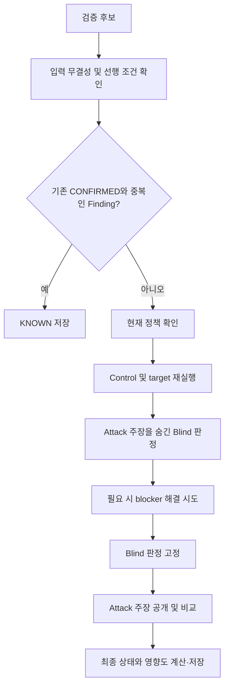
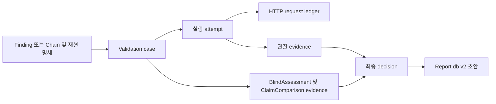

# Validation 구현 설명서

- 작성 기준: 2026-09-15
- 예시의 URL·관찰·점수는 설명용 가정이며 실제 스캔 결과가 아니다.

## 목차

1. [한눈에 보는 Validation](#overview)
2. [검증 대상과 입력 조건](#inputs)
3. [후보 하나가 검증되는 과정](#walkthrough)
4. [최종 판정 규칙](#decisions)
5. [재현 방식별 동작](#runtimes)
6. [실행 통제와 증거 관리](#controls)
7. [저장·중단 복구·보고서](#persistence)
8. [실행 방법과 현재 제약](#operations)
9. [부록 A. 코드 위치 안내](#code-map)
10. [부록 B. 용어 정리](#glossary)
11. [부록 C. 관련 문서](#references)

<a id="overview"></a>

## 1. 한눈에 보는 Validation

### 입력과 출력

| 구분 | 내용 |
|---|---|
| 입력 | Attack의 Finding 또는 Chaining의 demonstrated Chain, 재현 계약, 기존 증거 |
| 처리 | 입력 무결성 확인 → 정책 확인 → 새 요청 실행 → 관찰 해석 → 상태 계산 |
| 출력 | `Pipeline.db`에 저장된 case 상태, 관찰 증거, 판정 근거, 영향도 |
| 다음 단계 | `CONFIRMED` case로 보고서 초안 생성 |

### 누가 무엇을 결정하나

| 구성 요소 | 맡은 일 |
|---|---|
| ValidationCoordinator | 후보별 실행 순서와 재시도·저장·복구 관리 |
| Runtime adapter | 고정된 계약에 따라 HTTP·Browser·OOB·Chain 실행 |
| Blind LLM | 정제된 새 관찰을 해석하고 영향도와 blocker(전제 조건) 파악 |
| DecisionEngine | 정해진 우선순위로 최종 상태 계산 |

여기서 LLM은 1. Blind 재현과 2. Attack 주장과 일치하는지 판단하는 곳에 쓰인다.



흐름도는 정상 진행 경로를 요약한 것이다. 

입력 오류나 정책 거절 등은 해당 단계에서
조기 종료한다. Chain은 node 상태를 먼저 검사하며 Finding의 KNOWN 검색 경로를 거치지 않는다.

### 현재 구현 범위

HTTP·Browser·OOB·Chain 재현, Blind 판정, DB 저장, 중단 복구, CLI와 Reporting이 연결돼 있다.

다만 기본 native 구성에는 **blocker 해결 실행기가 연결되지 않았고**, 현재 작업 트리의
**Attack 전용 메서드 권한이 Validation 권한으로 이어지지 않는다**. 자세한 제약은 8장에서 설명한다.

<a id="inputs"></a>

## 2. 검증 대상과 입력 조건

### Finding과 Chain

| 대상 | 의미 | 검증 초점 |
|---|---|---|
| Finding | Attack이 발견한 개별 취약점 후보 | 해당 요청으로 보안 효과가 다시 나타나는가 |
| Chain | 여러 Finding을 순서대로 연결한 시나리오 | 단계 간 값 전달을 포함해 최종 효과까지 재현되는가 |

대상을 지정하지 않은 실행은 해당 scan의 `unreviewed`/`confirmed` Finding을 먼저,
`demonstrated` Chain을 다음으로 순차 처리한다.

### 후보에 필요한 데이터

Attack의 `commit-finding`은 다음 정보를 하나의 transaction으로 기록한다.

- Finding과 근거가 된 request·attempt
- Endpoint, HTTP method, parameter, payload template, 필요한 identity role
- Policy·Skill·request fingerprint에 연결된 변경 불가 재현 명세
- Target, positive control, negative control의 구체적인 runtime contract

Validation의 `CandidateIntegrityGate`는 Attack stage 완료 여부, 성공 attempt,
Skill hash와 요청·정책·payload·증거 간 관계를 다시 검사한다.
맞지 않으면 요청을 보내지 않고 해당 case를 `INCONCLUSIVE`로 종료한다.

**성공 증거의 형식도 검사한다.** HTTP 상태 코드만 있는 proof, 지연 기준값이 없는 timing proof,
console 실행 marker가 없는 XSS proof 등은 허용하지 않는다. Target과 negative control은
동일한 marker·selector·threshold를 평가해야 한다.

### KNOWN: 이미 검증한 Finding인가

같은 scan의 현재 `CONFIRMED` case와 다음 항목이 모두 같으면 `KNOWN`으로 처리한다.

| 비교 항목 | 규칙 |
|---|---|
| 취약점·위치 | 취약점 유형, endpoint template, HTTP method 일치 |
| 입력 지점 | Injection 위치와 parameter 이름 일치 |
| 권한 조건 | 필요한 identity role 일치. 선언 순서는 무시 |
| 검증 대상 Skill | Hunt Skill 이름 일치 |

<a id="walkthrough"></a>

## 3. 후보 하나가 검증되는 과정

### 예시: 다른 사용자의 문서를 읽었다는 주장

Attack이 “일반 사용자 A가 `GET /documents/{id}`에서 사용자 B의 문서를 읽었다”고
주장한 Finding을 생각해 보자. 필요한 재현 계약과 credential reference가 저장돼 있다고 가정한다.

### ① 후보와 재현 계약 확인

저장된 요청·증거·Skill·정책의 연결이 유효한지 검사한다.
기존 `CONFIRMED` Finding과 정확히 중복이면 여기서 `KNOWN`으로 끝낸다.

### ② 현재 정책 확인

Endpoint와 method가 현재 Validation 정책에 허용돼 있는지 확인한다.
예시의 문서 경로 또는 GET이 허용되지 않으면 `OUT_OF_SCOPE`다.

### ③ Control과 target 실행

Control은 결과를 해석하기 위한 비교 실험이다. 구체적인 요청과 assertion은
저장된 runtime contract에서 가져온다. 아래는 개념을 설명하는 예다.

| 실행 | 횟수 | 예시에서 확인할 내용 |
|---|---|---|
| Positive control | 1회 | 정상적으로 관찰할 수 있는 문서에서 기대한 신호가 보이는가 |
| Negative control | 1회 | 취약점이 발동하지 않는 비교 요청에서는 같은 신호가 나타나지 않는가 |
| Target | 3회 | A의 권한으로 B의 문서에 접근했을 때 보안 효과가 반복되는가 |

최초 target 결과가 성공·실패로 섞이면 target을 2회 더 실행한다.
이 추가 실행은 성공 횟수를 채워 `CONFIRMED`로 올리는 절차가 아니다. 판정 규칙은 4장에 정리했다.

### ④ Attack 주장을 숨긴 Blind 판정

LLM에는 Skill·profile, 요청 구조·권한 역할, 정제된 새 관찰을 전달한다.
이 시점에는 “다른 사용자의 문서를 읽었다”는 Attack의 결론과 영향 주장을 공개하지 않는다.

LLM은 `BlindAssessment`로 관찰의 의미, 재현 여부, blocker와 영향도 축별 점수를 제안한다.
영향도 해석에는 LLM이 참여하지만 최종 상태와 점수 합산 규칙은 Python 코드가 적용한다.

### ⑤ 필요한 경우 blocker 해결 시도

예를 들어 인증 상태가 만료돼 재현이 막혔다면, profile에 허용 action이 있고
`prerequisite_resolver`가 주입된 경우에만 해결을 시도한다.

- 해당 blocker의 action을 최대 2개까지 순서대로 시도한다.
- 하나가 성공하면 멈추고 control 각 1회·target 3회를 새로 실행한다.
- 최종 판정에는 새 batch의 관찰과 새 BlindAssessment를 사용한다.
- 이 재실행 batch에는 결과 혼재 시 2회를 추가하는 분기가 없다.

기본 native 구성에는 이 resolver가 없다. 따라서 기본 실행에서 인증 갱신이나
두 번째 identity 준비가 자동 수행된다고 이해하면 안 된다.

### ⑥ Blind 판정 고정 후 Attack 주장 공개

BlindAssessment를 hash와 함께 고정한 뒤, 같은 case의 LLM 세션에 Attack 주장을 공개한다.
`ClaimComparison`은 새 관찰의 해석과 Attack 주장이 일치하는지 비교한다.

두 응답 모두 schema가 잘못되면 한 번 수정 기회를 준다. 다시 실패하면 해당 case를
`INCONCLUSIVE`로 격리한다. 다음 case는 새로운 thread와 작업 directory에서 시작한다.

### ⑦ 최종 상태와 영향도 저장

예시에서 control이 적절하고 target 3회가 모두 성공했으며, blocker·의미 충돌 없이
영향도 기준도 통과했다면 `CONFIRMED`가 된다.
상태, 관찰 증거, 비교 결과와 영향도는 `Pipeline.db`에 연결해 저장한다.

<a id="decisions"></a>

## 4. 최종 판정 규칙

### 우선순위: 먼저 해당하는 조건으로 결정한다

다음 표는 `DecisionEngine`의 검사 순서다. Coordinator는 무결성·KNOWN·정책 등을
앞에서 처리하거나 schema 오류를 별도로 종료할 수 있다. Chain node 검사는 5장을 참고한다.

| 순서 | 조건 | 결과 |
|---|---|---|
| 1 | 후보 무결성 실패 | `INCONCLUSIVE` |
| 2 | 유효한 기존 CONFIRMED와 중복 | `KNOWN` |
| 3 | 현재 정책 거절 | `OUT_OF_SCOPE` |
| 4 | Positive control 실패 또는 negative control에서도 신호 발생 | `INCONCLUSIVE` |
| 5 | 명시적인 비취약 관찰 증거 존재 | `DISPROVEN` |
| 6 | 원인 불명 또는 환경 구성 문제 | `INCONCLUSIVE` |
| 7 | 해결 가능한 blocker가 남음 | Development 전에는 내부 상태 `DEVELOPING`, 처리 후에는 `BLOCKED` |
| 8 | Target 관찰이 정확히 3회 모두 성공한 상태가 아님 | `INCONCLUSIVE` |
| 9 | Blind 해석과 Attack 주장이 충돌하고 Attack 증거도 존재 | `CONTESTED` |
| 10 | 영향도 결과 없음 | `INCONCLUSIVE` |
| 11 | 기술 영향이 최소 기준 미달 | `UNDERPOWERED` |
| 12 | 위 조건에 해당하지 않음 | `CONFIRMED` |

`DEVELOPING`은 내부 상태다. Coordinator는 최종 저장 시 남아 있는 `DEVELOPING`을
`BLOCKED`로 바꾼다. Resolver나 action이 없어 실제 해결 작업을 수행하지 못한 경우도 포함한다.

**신호가 보이지 않았다는 사실만으로 `DISPROVEN`이 되지는 않는다.**
명시적인 비취약 증거 없이 target이 모두 실패했다면 관찰 횟수·성공 조건에서 `INCONCLUSIVE`가 된다.
또한 control 실패는 명시적 비취약 증거보다 먼저 판정한다.

### 추가 replay가 있어도 CONFIRMED가 되지 않는 이유

다음은 다른 선행 판정 조건이 없고, development로 새 batch를 만들지 않은 경우다.

| 최종 target 관찰 | 판정 |
|---|---|
| 성공 / 성공 / 성공 | 의미 비교·영향도 검사로 진행 |
| 실패 / 실패 / 실패 | `INCONCLUSIVE` |
| 성공 / 실패 / 성공 → 추가 성공 / 성공 | 총 5회이므로 `INCONCLUSIVE` |

코드는 다수결을 사용하지 않는다. 5회 관찰이 최종 입력이면 모두 성공이어도
관찰 조건 검사에서 `INCONCLUSIVE`로 처리한다.

### Impact와 severity

BlindAssessment의 세 축 점수는 각각 0~3이다. 각 축의 해석 기준은 Hunt Skill의 profile에 있다.

| 축 | 해석 대상 |
|---|---|
| Boundary | 확인된 보안 경계 침범 |
| Sensitivity | 영향받은 데이터·기능의 민감도 |
| Actor requirements | 공격 주체에게 필요한 권한·조건 |

Python은 세 점수를 합산해 다음 severity를 계산한다.

| 합계 | Severity |
|---|---|
| 0~2 | INFO |
| 3~4 | LOW |
| 5~6 | MEDIUM |
| 7~8 | HIGH |
| 9 | CRITICAL |

Boundary 또는 Sensitivity가 0이거나 합계가 3 미만이면 `UNDERPOWERED`다.
예를 들어 `(2, 2, 1)`은 합계 5, MEDIUM이며 영향도 최소 기준을 통과한다.
최종 `CONFIRMED` 여부는 앞선 모든 조건도 통과해야 한다.

이 점수에는 설치 수, 사용자 수, 버그바운티 프로그램의 접수·보상 규칙이 포함되지 않는다.

<a id="runtimes"></a>

## 5. 재현 방식별 동작

Runtime adapter는 저장된 계약의 `runtime_kind`에 따라 선택된다.
58개 non-chain Hunt Skill의 profile은 검증할 보안 효과와 허용 실행 방식을 정의하고,
실제 marker·selector·threshold는 대상별 runtime contract가 정한다.

| 방식 | 실행 방법 | 확인하는 증거 | 필요한 구성·제약 |
|---|---|---|---|
| HTTP | Path·query·header·body로 요청 재구성 | Status, header, body marker, JSON path, duration assertion | 기본 native adapter 제공. 상태 코드만으로 취약점 proof를 만들 수 없음 |
| Browser | Body 없는 navigation 실행 | DOM selector, URL, console assertion | Python Playwright와 Chromium 필요. XSS proof에는 console 실행 marker 필요 |
| OOB | Observer 준비 → HTTP trigger → callback 조회 | Attempt별 새 token 및 protocol과 일치하는 event | Observer 설정 필요. 다른 attempt의 callback은 성공 근거가 아님 |
| Chain | Node 순서대로 실행하고 단계 사이 값을 전달 | 마지막 단계의 terminal assertion과 effect | 중간 source step은 HTTP만 허용. Browser·OOB는 terminal step으로 사용 가능 |

### Chain은 node 성공과 전체 성공을 따로 확인한다

Node가 각각 검증됐더라도 Chain 전체가 자동으로 성공하는 것은 아니다.
단계 간 binding과 마지막 보안 효과를 포함한 end-to-end replay가 필요하다.

재현 전 node 상태 검사는 다음 우선순위를 따른다.

1. Node가 없으면 `INCONCLUSIVE`.
2. `DISPROVEN` node가 있으면 Chain도 `DISPROVEN`.
3. 다음으로 `OUT_OF_SCOPE`, `BLOCKED` node가 있으면 해당 상태 적용.
4. 미검증·`CONTESTED`·`UNDERPOWERED`·`INCONCLUSIVE` node가 있으면 `INCONCLUSIVE`.
5. 모든 node가 유효한 `CONFIRMED` 또는 `KNOWN`이면 계약 무결성 검사 후 전체 재현.

Chain의 영향도는 node 점수의 합이 아닌 **최종 효과**로 다시 계산한다.
이전 응답, 실제 binding 값, terminal impact claim은 Blind 문맥에서 숨긴다.
기존 Chaining 테이블은 Validation이 수정하지 않는다.

<a id="controls"></a>

## 6. 실행 통제와 증거 관리

### LLM은 관찰을 해석하고, 요청은 코드가 실행한다

Native Validation LLM은 read-only sandbox에서 shell·web·browser·apps 등 도구를 끈 상태로 실행된다.
요청 대상과 payload, batch 순서는 Coordinator와 adapter가 다룬다.
LLM이 직접 네트워크 요청을 만들거나 최종 상태를 저장하지 않는다.

Case 내부의 Blind·unblind는 같은 thread를 사용하지만 다음 case에는 재사용하지 않는다.
중단 복구에서는 고정된 BlindAssessment로 새 thread에서 비교를 시작할 수 있다.

### 요청과 credential 경계

- 요청과 redirect hop에 정책을 적용하고 요청 예산·rate·concurrency를 검사한다.
- 요청 ledger를 통해 scan·stage·case·attempt의 소유권을 추적한다.
- Coordinator는 adapter가 인용한 request ID가 현재 실행의 `completed` row인지 다시 확인한다.
- Credential은 DB에 opaque reference로 저장하고 요청 시점에 해석한다.
- 기본 resolver는 `env://`와 `keyring://SERVICE/ACCOUNT`를 지원한다.
- 추가 secret backend는 trusted application이 주입해야 한다.

해석된 credential은 CR/LF가 없는 1~32개의 HTTP header map이어야 한다.
Credential을 읽는 resolver와 blocker를 해결하는 `prerequisite_resolver`는 서로 다른 역할이다.

### 무엇을 증거로 남기나

실제 응답·DOM·callback 원문을 evidence에 그대로 저장하지 않고 hash와 정제된 요약을 남긴다.
Metadata의 secret·민감 header·raw body를 제거하고 깊이·항목 수·크기를 제한한다.
요청 ledger의 query 값도 가린다.

Hash와 DB 참조는 “어느 요청·관찰로 이 판단을 만들었는가”를 확인하는 데 사용한다.
Hash 자체가 취약점의 진위를 증명하는 것은 아니며, 진위 판단에는 새 관찰과 control이 필요하다.

<a id="persistence"></a>

## 7. 저장·중단 복구·보고서

### 주요 데이터 관계

현재 저장소는 공용 `Pipeline.db` schema v9다. 아래는 이해를 위한 관계 요약이다.



Case에는 상태와 처리 단계가, attempt에는 개별 실행 결과가 기록된다.
Development action과 impact hypothesis도 별도 저장한다.
Case 변경에는 버전 확인을 적용하며 재현 명세는 DB trigger로 update·delete를 막는다.

### 중단 후 무엇을 재사용하나

| 남아 있는 상태 | Resume 동작 |
|---|---|
| 완료된 replay batch | 증거와 참조 검증 후 관찰 재사용 |
| 고정된 BlindAssessment | Hash 검증 후 재사용, 새 thread에서 unblind 가능 |
| 저장된 ClaimComparison | Hash와 참조 검증 후 재사용 |
| 실행 결과가 불명확한 `outcome_unknown` | 자동 재전송하지 않고 `INCONCLUSIVE`로 종료 |

같은 `stage_run_id`로 resume한다. 중단된 case의 처리 단계는 `interrupted`,
진행 중 attempt는 `outcome_unknown`으로 남는다. 결과를 모르는 요청을 자동 재전송하지 않는 이유는
원격 상태 변경을 중복 실행할 수 있기 때문이다.

### KNOWN과 보고서의 유효성

KNOWN이 참조한 source case가 더 이상 `CONFIRMED`가 아니면 해당 KNOWN도
자동으로 `INCONCLUSIVE`가 된다.

신규 보고서 초안은 완료된 최신 `CONFIRMED` case만 입력으로 받는다.
보고서는 scan·case ID, decision hash, 정렬된 evidence hash에 연결된다.
Decision이 바뀌면 기존 파일을 지우지 않고 `stale`로 표시한다.
KNOWN은 원본 case를 안내하고, CONTESTED는 검토 대상으로 취급한다.

<a id="operations"></a>

## 8. 실행 방법과 현재 제약

### CLI 사용 예시

프로젝트 환경에 `aidast`가 설치돼 있다고 가정한다. 아래 ID는 실제 DB의 값으로 바꿔야 한다.

```bash
# Scan 전체 검증
aidast validate run Pipeline.db --scan-id scan_123

# Finding 또는 Chain 하나 검증
aidast validate run Pipeline.db --scan-id scan_123 --finding-id finding_123
aidast validate run Pipeline.db --scan-id scan_123 --chain-id chain_123

# 중단된 stage 재개
aidast validate resume Pipeline.db --stage-run-id stage_123 --policy TargetPolicy.json

# 결과 조회
aidast validate status Pipeline.db --scan-id scan_123
aidast validate status Pipeline.db --case-id case_123

# CONFIRMED case로 로컬 보고서 초안 생성
aidast report run Pipeline.db --case-id case_123 --platform hackerone --output-dir ReportRun
```

`--finding-id`와 `--chain-id`는 함께 사용할 수 없다. Status는 scan 또는 case 중 하나를 선택한다.
Run·resume에서 `--policy`를 생략하면 DB 옆 `TargetPolicy.json`을 사용한다.
전체 `aidast run`은 Chaining 직후 native Validation을 실행한다.

### 실행 환경

| 항목 | 필요한 구성 |
|---|---|
| 공통 | Pipeline.db, 유효한 TargetPolicy.json, 후보의 재현 계약 |
| Blind LLM | Native Codex 실행 환경과 로그인. 기본 Validation 모델은 `gpt-5.6-sol` |
| HTTP | 기본 native adapter 사용. 인증이 필요하면 credential reference 구성 |
| Browser | Python Playwright와 Chromium |
| OOB | `AIDAST_OOB_OBSERVER_CONFIG`로 observer 구성. Arm/poll JSON endpoint는 HTTPS·동일 origin |
| Development | Application이 `prerequisite_resolver`를 Coordinator에 주입 |

계약이나 필요한 executor·observer·credential이 없으면 성공으로 대체하지 않는다.
Case preflight에서 `INCONCLUSIVE`로 처리할 수 있으며, 잘못된 전역 정책·observer 설정은
native Coordinator 생성 자체를 실패시킬 수 있다.

### 현재 알아야 할 제약

| 제약 | 실제 영향 |
|---|---|
| Native development resolver 미연결 | 인증 갱신·두 번째 identity 준비를 자동 수행하지 않음 |
| Attack·Validation 메서드 권한 분리 | Attack에만 허용한 method가 Validation에서 거절될 수 있음 |
| Browser·OOB는 Chain의 마지막 단계만 지원 | 중간 단계의 binding source로 사용할 수 없음 |
| 과거 Validation.db·Report v1 경로 제거 | 과거 DB 자동 이관을 제공하지 않음 |

메서드 권한 차이는 **작성 시점의 미커밋 구현을 포함한 설명**이다.
Attack은 `attack_allowed_methods`를 사용하지만 Validation의 policy provider와 요청 경계는
`allows_url()`을 통해 `allowed_methods`를 검사한다.
예를 들어 POST가 Attack에만 허용돼 있으면 무결성·KNOWN 검사 이후 정책 단계에서
`OUT_OF_SCOPE`가 될 수 있다. Attack의 task별 승인 envelope도 replay 권한으로 자동 이어지지 않는다.

### 테스트로 확인한 범위

2026-09-15 문서 대조 작업에서 수행한 테스트 기록이다. 이 설명서 작성 중 새로 실행한 결과는 아니다.
실행 위치는 `recon-attack-pipeline/`다.

| 명령 | 결과 |
|---|---|
| `.venv/bin/python -m unittest discover -s tests -p 'test_validation*.py' -q` | 98개 통과, live acceptance 1개 생략 |
| `TMPDIR=/private/tmp .venv/bin/python -m unittest discover -s tests -p 'test_shared_validation_reporting.py' -q` | 3개 통과 |

Reporting은 기본 임시 경로의 symlink 제한 오류 후 위 TMPDIR로 재실행해 통과했다.
전체 테스트·compileall·외부 target E2E·실제 Codex CLI 호출은 이 대조 작업에서 재검증하지 않았다.

별도의 local live acceptance는 `AIDAST_LIVE_ACCEPTANCE=1`에서 활성화된다.
실제 HTTP socket·control·target 3회·ledger·최종 snapshot을 검사하지만,
저장된 Attack 계약에서 시작하고 판정 Agent를 fixture로 주입한다.
따라서 외부 target에서 Recon부터 계약 생성, 실제 LLM 호출까지 이어지는 전체 운영 검증은 별도로 필요하다.

<a id="code-map"></a>

## 부록 A. 코드 위치 안내

먼저 Coordinator를 보고, 궁금한 단계의 모듈로 이동하면 된다.

| 궁금한 내용 | 코드 |
|---|---|
| 전체 실행 순서·개발 action·복구 | [coordinator.py](../../../src/aidast/validation/coordinator.py) |
| 최종 상태 우선순위 | [decision.py](../../../src/aidast/validation/decision.py) |
| 영향도 계산 | [impact.py](../../../src/aidast/validation/impact.py) |
| 후보 무결성과 KNOWN | [integrity.py](../../../src/aidast/validation/integrity.py), [matching.py](../../../src/aidast/validation/matching.py) |
| Proof 의미 검사 | [runtime_semantics.py](../../../src/aidast/validation/runtime_semantics.py) |
| Native 구성과 adapter 선택 | [native.py](../../../src/aidast/validation/native.py), [runtime_adapter.py](../../../src/aidast/validation/runtime_adapter.py) |
| HTTP·Browser 재현 | [http_adapter.py](../../../src/aidast/validation/http_adapter.py), [browser_adapter.py](../../../src/aidast/validation/browser_adapter.py) |
| OOB·Chain 재현 | [oob_adapter.py](../../../src/aidast/validation/oob_adapter.py), [chain_adapter.py](../../../src/aidast/validation/chain_adapter.py) |
| Blind 입력과 LLM 실행 | [blind.py](../../../src/aidast/validation/blind.py), [codex_runner.py](../../../src/aidast/validation/codex_runner.py) |
| 요청·증거·credential 경계 | [request_broker.py](../../../src/aidast/validation/request_broker.py), [evidence_policy.py](../../../src/aidast/validation/evidence_policy.py), [credentials.py](../../../src/aidast/validation/credentials.py) |
| DB 저장과 조회 | [repository.py](../../../src/aidast/validation/repository.py), [status.py](../../../src/aidast/validation/status.py) |
| 보고서와 CLI | [case_runtime.py](../../../src/aidast/reporting/case_runtime.py), [cli.py](../../../src/aidast/cli.py) |

<a id="glossary"></a>

## 부록 B. 용어 정리

| 용어 | 이 문서에서의 뜻 |
|---|---|
| Case | Finding 또는 Chain 하나를 추적하는 검증 단위 |
| Attempt | Control 또는 target의 개별 실행 |
| Batch | Control과 target을 묶은 한 차례 실험 |
| Fresh replay | 저장된 결과를 믿는 대신 요청을 새로 실행하는 것 |
| Assertion | 응답에서 무엇을 성공 신호로 확인할지 정한 조건 |
| Runtime contract | 대상별 요청과 assertion을 담은 실행 계약 |
| Validation profile | Skill별 보안 효과·control·impact·허용 action 규칙 |
| Blind / unblind | Attack 주장을 숨긴 판정 / 고정 후 주장을 공개한 비교 |
| Blocker / development | 재현을 막는 조건 / 허용된 범위에서 그 조건을 해결하는 절차 |
| Binding / terminal effect | Chain 단계 사이의 값 전달 / 마지막 단계에서 확인한 효과 |
| Ledger | 실제 요청의 소유권과 실행 상태를 추적하는 기록 |
| Stale | 현재 판정과 연결이 달라져 최신 보고서로 볼 수 없는 상태 |

<a id="references"></a>

## 부록 C. 관련 문서

- [구현 현황 상세 문서](VALIDATION_IMPLEMENTATION_OVERVIEW.md): 세부 계약과 설계 대비 차이
- [누적 변경 기록](VALIDATION_REFACTOR_CHANGES.md): 구현 변경 이력
- [재구조화 설계](../../superpowers/specs/2026-09-12-validation-refactor-design.md): 설계 의도
- [구현 계획](../../superpowers/plans/2026-09-12-validation-refactor-implementation.md): 작업 분해와 검증 계획

실제 동작을 판단할 때는 작성 기준 시점과 현재 코드를 함께 확인한다.
